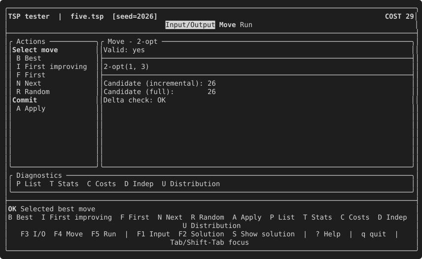
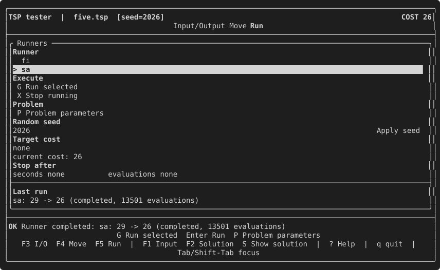

# Coming from EasyLocal 3

This page is for readers with an EasyLocal 3 program to port. It first lists
the main differences between the two versions, then migrates a complete
EasyLocal 3 program, the TSP with 2-opt moves, one piece at a time, up to the
TSP of the [tutorial](tutorial/README.md).

## The main differences

The concepts of the two versions are mapped one to one in the
[comparison with EasyLocal 3](tutorial/16-comparison-with-easylocal-3.md) of
the tutorial. Beyond the names:

- **No virtual dispatch and no required base classes.** Capabilities are
  checked by concepts at compile time; the bases are optional conveniences.
- **Only what is used is written.** A component implements the members the
  composed algorithms and tools call, not a whole interface: an explorer used
  only by Simulated Annealing has `random_move` and no enumeration.
- **Services are bound to an immutable Input** instead of being reconfigured,
  so concurrent runs only share the Input. The SolutionManager, the explorers,
  the cost components and the deltas receive it in their constructor, the
  place for data precomputed from the instance; values (Input, Solution, Move)
  hold no Input, and hooks such as `read_solution` receive it as a parameter
  (see the [problem model](reference/problem-model.md#design-choices)).
- **The cost always comes from cost components**, and their composition (the
  cost layer and the delta cost layer) is described by recipes.
- **Hard and soft are not flags on a component.** A cost expression in the
  recipe states them, with each weight beside its term:
  `cost::hard_soft(cost::sum(component<A>(), component<B>()), component<C>() * 10)`.
  The hard cost is a separate level, not a large multiplier, so it can never be
  traded for soft improvements.
- **Randomness is explicit**: RNGs are passed in, never hidden in services.
- **The search loop's machinery belongs to the framework** (`search_run`):
  counters, budget, cancellation, progress and events are not reimplemented by
  each runner.

## Before you start

- EasyLocal needs a C++23 compiler (see the [quick start](quick-start.md))
  and no longer depends on Boost: the command line is parsed by the library.
- Headers and names have changed: `#include <easylocal/easylocal.hpp>` and the
  namespace `easylocal` replace `easylocal.hh` and `EasyLocal::Core`. The
  CMake target is `EasyLocal::Core`, from
  `find_package(EasyLocal CONFIG REQUIRED COMPONENTS Core)`.
- In place of `using namespace EasyLocal::Core;`, give the namespace a short
  alias, as the code of this page does:

  ```cpp title="EasyLocal 4"
  namespace el = easylocal;               // el::app, el::component, ...
  namespace runners = easylocal::runners; // runners::FirstImprovement, ...
  ```

  `el::app` is then `easylocal::app`. The aliases go in a function or a source
  file, not in a header, where they would reach every file that includes it
  (see the [conventions of the tutorial](tutorial/README.md#conventions-of-the-code)).
- Migrate in the order of this page, and run the program after each group
  of steps. A first version needs only the SolutionManager, the cost
  components and one explorer: without delta evaluators, moves are evaluated
  on a copy of the solution with the move applied. Add the deltas afterwards,
  one at a time, and let the Session check each against the full evaluation
  (step 6), as EasyLocal 3's `MoveTester` did.

## Migrating a program, step by step

The EasyLocal 3 code of this section is the TSP of the
[benchmarks](benchmarks.md) that compare the two versions, abridged; the
EasyLocal 4 code is the tutorial's, which is compiled and tested.

### 1. The Input

An EasyLocal 3 Input was a class that read its own file in the constructor:

```cpp title="EasyLocal 3"
class Input
{
public:
    explicit Input(const std::string& path)
    {
        std::ifstream is(path);
        is >> city_count;
        distances.resize(city_count * city_count);
        for (auto& d : distances)
            is >> d;
    }
    double Distance(std::size_t from, std::size_t to) const;

    std::size_t city_count = 0;
    std::vector<double> distances;
};
```

Now the Input is a plain value, and reading it is a separate hook, so that an
Input can also be built in code (as in the tests) or received over HTTP:

<!-- snippet: tutorial/tsp.hpp:model -->
```cpp title="EasyLocal 4"
// Input: the instance, immutable during the search.
struct Tsp
{
    // distance[a][b] is the distance between cities a and b (symmetric).
    std::vector<std::vector<double>> distance;

    std::size_t cities() const
    {
        return distance.size();
    }
};

// Solution: order[k] is the k-th city visited; after the last city the tour
// returns to order[0].
struct Tour
{
    std::vector<std::size_t> order;
};

// Move: exchange the cities visited at positions i and j, with i < j.
struct SwapCities
{
    std::size_t i;
    std::size_t j;
};
```

Move the body of the file constructor into a free function `read_input`, next
to the type, which reads from a stream and returns the Input; the library
finds it by argument-dependent lookup (step 8 shows all the hooks):

<!-- snippet: tutorial/tsp.hpp:read-input -->
```cpp title="EasyLocal 4"
inline Tsp read_input(std::type_identity<Tsp>, std::istream& in)
{
    std::size_t cities = 0; // "n", then the n rows of the distance matrix
    if (!(in >> cities))
        throw std::runtime_error{"invalid TSP header"};
    Tsp tsp{.distance = std::vector(cities, std::vector<double>(cities))};
    for (auto& row : tsp.distance)
        for (auto& value : row)
            if (!(in >> value))
                throw std::runtime_error{"invalid TSP distances"};
    return tsp;
}
```

`std::type_identity<Tsp>` only selects the function by the type it reads,
since a function cannot be overloaded on its return type alone.

Legacy code keeps working: the library also reads the Input with a static
`Input::read(std::istream&)` or, as EasyLocal 3 programs often did, with an
`operator>>`, used when there is neither `Input::read` nor `read_input`. For
`operator>>` the Input needs a default constructor, since the library creates
it and then reads into it:

```cpp title="EasyLocal 4 — legacy alternative"
struct Tsp
{
    std::vector<std::vector<double>> distance;
};

// Used when there is no Tsp::read and no read_input: Tsp{} is created, then
// read.
std::istream& operator>>(std::istream& in, Tsp& tsp);
```

The accessors of the Input, such as `Distance(from, to)`, can stay as they
are: the library never calls members of the Input.

### 2. The Solution

An EasyLocal 3 State was constructed from the Input and often kept a
reference to it:

```cpp title="EasyLocal 3"
class Tour
{
public:
    explicit Tour(const Input& in) : tour(in.city_count) {}
    std::vector<std::size_t> tour;
};
```

`Tour` above is the EasyLocal 4 Solution: a value that can be copied, moved
and assigned.

- The reference to the Input is no longer needed: the SolutionManager, the
  explorers, the cost components and the deltas are all constructed from the
  current Input, so every member that receives a solution can reach the Input
  too (`input()` in the bases, or the member it was stored in), and the hooks
  that read and write a solution take it as a parameter. Keeping it is
  possible but not recommended: the runners copy and assign solutions, which a
  reference member forbids and a pointer (`const Input*`) only allows with
  care, since every copy must point to the same Input that outlives it.
- A constructor that takes the Input only to size the containers can go as
  well: the SolutionManager builds solutions (step 4), with the Input at hand.
- Data derived from the solution for speed (redundant matrices, counters) may
  stay in the Solution. Keep them up to date in `make_move`, and leave them out
  of solution identity with the SolutionManager's `hash` and `equal` when a
  tabu list or a trace compares solutions (see the
  [SolutionManager reference](reference/solution-manager.md)).

An EasyLocal 3 State was read and written with stream operators, used by the
tester and by `main` to load an initial state and print the result:

```cpp title="EasyLocal 3"
std::ostream& operator<<(std::ostream& os, const Tour& st);
std::istream& operator>>(std::istream& is, Tour& st);
```

They become two free functions next to the type, `write_solution` and
`read_solution`, which also receive the Input: reading a solution may need
the instance (here, the number of cities), and the Solution no longer holds
it:

<!-- snippet: tutorial/tsp.hpp:solution-io -->
```cpp title="EasyLocal 4"
inline Tour read_solution(const Tsp& tsp, std::istream& in)
{
    Tour tour{std::vector<std::size_t>(tsp.cities())};
    for (auto& city : tour.order)
        if (!(in >> city))
            throw std::runtime_error{"invalid tour"};
    return tour;
}

inline void write_solution(const Tsp&, const Tour& tour, std::ostream& out)
{
    for (const auto city : tour.order)
        out << city << ' ';
    out << '\n';
}
```

Legacy code keeps working here too. Without `write_solution` (or a member
`solution.write(input, out)`), the library writes the solution with its
`operator<<`, which also gives its text in the tester when there is no
`describe`. Without `read_solution` (or a static
`Solution::read(input, in)`), it reads with `operator>>` into
`Solution{input}`: that path needs a constructor from the Input, so an
EasyLocal 3 State that keeps the one sizing its containers can keep its
operators unchanged.

### 3. The Move

An EasyLocal 3 Move was a class with a constructor that set its attributes,
with default arguments, since the runners declared a Move and then filled it,
and the comparison and stream operators the framework required:

```cpp title="EasyLocal 3"
class TwoOpt
{
public:
    TwoOpt(std::size_t first_edge = 0, std::size_t second_edge = 0)
        : first_edge(first_edge), second_edge(second_edge) {}
    std::size_t first_edge, second_edge;
};
bool operator==(const TwoOpt& a, const TwoOpt& b);
bool operator!=(const TwoOpt& a, const TwoOpt& b);
bool operator<(const TwoOpt& a, const TwoOpt& b);
std::ostream& operator<<(std::ostream& os, const TwoOpt& mv);

// in the explorer
mv = TwoOpt(first_edge, second_edge);
```

In EasyLocal 4 the Move is a `struct` with public members and no constructor:

<!-- snippet: tutorial/tsp.hpp:two-opt-move -->
```cpp title="EasyLocal 4"
// Move: reverse the part of the tour between positions i + 1 and j.
struct TwoOpt
{
    std::size_t i;
    std::size_t j;
};
```

- **A struct, with public members**: the explorer, the deltas and the tester
  read the attributes of a move directly, and the move has no invariant to
  protect.
- **No constructor**: the struct is an aggregate, so it is created with braces,
  `TwoOpt{i, j}` or `TwoOpt{.i = i, .j = j}`, as the explorer of step 7 does.
  It is also default-constructible, `TwoOpt{}` with zero members, which an
  explorer with a cursor (`first_move`, `next_move`) needs; prefer these
  implicit constructors to writing one.
- **No operator is required**, but the ones you have can stay, and are used
  when present:
  - `operator==` by the neighborhood checks of a Session
    ([chapter 13](tutorial/13-checking.md));
  - `operator<<`, or `describe(move)`, for the text the tester shows;
  - `operator<` and `operator!=` are not used: remove them if nothing else
    needs them.

  In C++20 a defaulted `operator==` is enough, and the struct stays an
  aggregate:

  ```cpp title="EasyLocal 4 — optional"
  struct TwoOpt
  {
      std::size_t i;
      std::size_t j;

      bool operator==(const TwoOpt&) const = default;
  };
  ```

### 4. The SolutionManager

```cpp title="EasyLocal 3"
class TspSolutionManager : public SolutionManager<Input, Tour, CostStructure>
{
public:
    explicit TspSolutionManager(const Input& in)
        : SolutionManager<Input, Tour, CostStructure>(in, "TspSolutionManager") {}

    void RandomState(Tour& st) override
    {
        st.tour.resize(in.city_count);
        std::iota(st.tour.begin(), st.tour.end(), std::size_t{0});
        std::shuffle(st.tour.begin(), st.tour.end(), Random::GetGenerator());
    }

    bool CheckConsistency(const Tour& st) const override
    {
        return st.tour.size() == in.city_count;
    }
};
```

<!-- snippet: tutorial/tsp.hpp:solution-manager -->
```cpp title="EasyLocal 4"
class TourManager : public easylocal::solution_manager_base<Tsp, Tour>
{
public:
    using solution_manager_base::solution_manager_base;

    // The cities in index order: 0, 1, ..., n - 1.
    Tour initial_solution() const
    {
        Tour tour{std::vector<std::size_t>(input().cities())};
        std::ranges::iota(tour.order, std::size_t{0});
        return tour;
    }

    // The same cities in a random order.
    template<std::uniform_random_bit_generator RNG>
    Tour random_solution(RNG& rng) const
    {
        auto tour = initial_solution();
        std::shuffle(tour.order.begin(), tour.order.end(), rng);
        return tour;
    }

    // A tour is valid when it is a permutation of 0, 1, ..., n - 1: it has
    // n positions and visits every city exactly once.
    bool is_valid(const Tour& tour) const
    {
        return std::ranges::is_permutation(
            tour.order,
            std::views::iota(std::size_t{0}, input().cities()));
    }
};
```

| EasyLocal 3 | EasyLocal |
| --- | --- |
| constructor `(in, name)` | inherited: `using solution_manager_base::solution_manager_base;` |
| `in` | `input()` |
| `RandomState(Solution&)` with `Random::` | `random_solution(RNG&)`, which returns the solution |
| `GreedyState(Solution&)` | `initial_solution()`, which returns the solution |
| `CheckConsistency` | `is_valid`: the representation is well formed |
| `CostFunctionComponents`, `AddCostComponent` | the recipe (step 5) |
| `LowerBoundReached`, `OptimalStateReached` | a target cost for the run: `stop_at(cost)` |
| `StateDistance` | no counterpart |
| `PrintState`, `DumpState` | `describe(solution)`, `write_solution` (steps 2 and 8) |

The function that creates a random state needs no other change than taking
the generator as a parameter: replace `Random::GetGenerator()` and
`Random::Uniform<T>(a, b)` with `rng` and
`std::uniform_int_distribution<T>{a, b}(rng)`.

### 5. The cost components

```cpp title="EasyLocal 3"
class TourLength : public CostComponent<Input, Tour, double>
{
public:
    explicit TourLength(const Input& in)
        : CostComponent<Input, Tour, double>(in, 1.0, false, "TourLength") {}

    double ComputeCost(const Tour& st) const override
    {
        double total = 0.0;
        for (std::size_t position = 0; position < st.tour.size(); ++position)
            total += in.Distance(st.tour[position],
                                 st.tour[(position + 1) % st.tour.size()]);
        return total;
    }

    void PrintViolations(const Tour&, std::ostream&) const override {}
};
```

<!-- snippet: tutorial/tsp.hpp:cost-component -->
```cpp title="EasyLocal 4"
class TourLength
{
public:
    explicit TourLength(const Tsp& input) : input_{input} {}

    double evaluate(const Tour& tour) const
    {
        const auto n = tour.order.size();
        double length = 0.0;
        for (std::size_t k = 0; k < n; ++k)
        {
            const auto from = tour.order[k];
            const auto to =
                tour.order[(k + 1) % n]; // the last city goes back to the first
            length += input_.distance[from][to];
        }
        return length;
    }

private:
    const Tsp& input_;
};
```

- `ComputeCost` becomes `evaluate`; the component has no base class and keeps
  the Input it is constructed from.
- The weight and the hard flag leave the constructor and go into the cost
  expression of the recipe. A program with hard components `H1`, `H2` and soft
  components `S1` (weight 1) and `S2` (weight 5) becomes:

  ```cpp title="EasyLocal 4"
  el::solution_manager<Manager>()
      | el::cost::hard_soft(
          el::cost::sum(el::component<H1>(), el::component<H2>()),
          el::cost::sum(el::component<S1>(), el::component<S2>() * 5))
  ```

  `HARD_WEIGHT` is gone: the hard cost is compared first, so no soft gain can
  make up for a violation. When the weights of the hard components mattered
  only to guide the search, keep them inside the hard sum.
- `PrintViolations` has no counterpart: write it as a free function of your
  own if the program prints a report.
- An `int` component stays `int`; `DefaultCostStructure<double>` and the
  `CFtype` parameters disappear, since the cost type follows from what
  `evaluate` returns.

### 6. The delta cost components

```cpp title="EasyLocal 3"
class TwoOptTourLengthDelta : public DeltaCostComponent<Input, Tour, TwoOpt, double>
{
public:
    TwoOptTourLengthDelta(const Input& in, TourLength& cc)
        : DeltaCostComponent<Input, Tour, TwoOpt, double>(in, cc, "TwoOptTourLengthDelta") {}

    double ComputeDeltaCost(const Tour& st, const TwoOpt& mv) const override
    {
        const auto n = st.tour.size();
        const auto first = st.tour[mv.first_edge];
        const auto first_next = st.tour[(mv.first_edge + 1) % n];
        const auto second = st.tour[mv.second_edge];
        const auto second_next = st.tour[(mv.second_edge + 1) % n];
        return in.Distance(first, second) + in.Distance(first_next, second_next)
            - in.Distance(first, first_next) - in.Distance(second, second_next);
    }
};
```

<!-- snippet: tutorial/tsp.hpp:delta -->
```cpp title="EasyLocal 4"
class TwoOptLengthDelta
{
public:
    explicit TwoOptLengthDelta(const Tsp& input) : input_{input} {}

    // The tour goes a -> b ... c -> d; after the move it goes a -> c ... b -> d.
    double delta_evaluate(const Tour& tour, const TwoOpt& move) const
    {
        const auto n = tour.order.size();
        const auto a = tour.order[move.i];
        const auto b = tour.order[move.i + 1];
        const auto c = tour.order[move.j];
        const auto d = tour.order[(move.j + 1) % n];
        const auto& distance = input_.distance;
        return distance[a][c] + distance[b][d] - distance[a][b] - distance[c][d];
    }

private:
    const Tsp& input_;
};
```

- `ComputeDeltaCost` becomes `delta_evaluate`, with the same meaning: the
  change of the component's own value, without its weight.
- The link to the component leaves the constructor: the recipe states it,
  `delta<TourLength, TwoOptLengthDelta>()`. A delta can also be a member of the
  component itself (a *co-located* delta, [chapter 4](tutorial/04-delta-evaluation.md)).
- A component without a delta for some neighborhood needs nothing, as in
  EasyLocal 3 when it was added with `AddCostComponent` to the explorer: its
  change is computed on a copy of the solution with the move applied.

To check a delta against the full evaluation, as the `MoveTester`'s "check
neighborhood costs" did, use the Session ([chapter 13](tutorial/13-checking.md)):

<!-- snippet: tutorial/main.cpp:session-checks -->
```cpp title="EasyLocal 4"
// Each check enumerates the neighborhood of the current solution and
// returns a struct of counters (Session::..._result).

// The delta evaluation of each move against the full evaluation of the
// solution it leads to: moves (enumerated), mismatches (the two costs
// differ), invalid (moves that are not valid or lead to an invalid
// solution).
const auto costs = session.check_neighborhood_costs();

// What each move does to the solution: moves, null_moves (moves that leave
// it unchanged), repeated_states (moves that lead to a solution an earlier
// move reached), invalid.
const auto independence = session.check_move_independence();

// random_move against the enumeration: neighborhood_size (valid enumerated
// moves), samples (draws, 20 per move by default), out_of_neighborhood
// (draws that return no move or one the enumeration does not contain),
// unseen (enumerated moves never drawn), min_frequency and max_frequency
// (how often the least and the most drawn moves came up).
const auto sampling = session.check_random_move_distribution(session.rng());

if (costs.mismatches != 0 || costs.invalid != 0 || sampling.out_of_neighborhood != 0)
    return 1;
```

### 7. The NeighborhoodExplorer

```cpp title="EasyLocal 3"
class TwoOptNeighborhoodExplorer
    : public NeighborhoodExplorer<Input, Tour, TwoOpt, CostStructure>
{
public:
    TwoOptNeighborhoodExplorer(const Input& in, TspSolutionManager& sm)
        : NeighborhoodExplorer<Input, Tour, TwoOpt, CostStructure>(in, sm, "2-opt") {}

    bool FeasibleMove(const Tour& st, const TwoOpt& mv) const override;

    void RandomMove(const Tour& st, TwoOpt& mv) const override
    {
        const auto n = st.tour.size();
        if (n < 4)
            throw EmptyNeighborhood();
        while (true)
        {
            auto first_edge = Random::Uniform<std::size_t>(0, n - 1);
            auto second_edge = Random::Uniform<std::size_t>(0, n - 1);
            // ... ordered, and drawn again while not a valid move
        }
    }

    void FirstMove(const Tour& st, TwoOpt& mv) const override;   // throws EmptyNeighborhood
    bool NextMove(const Tour& st, TwoOpt& mv) const override;
    void MakeMove(Tour& st, const TwoOpt& mv) const override;
};
```

<!-- snippet: tutorial/tsp.hpp:two-opt -->
```cpp title="EasyLocal 4"
// Move: reverse the part of the tour between positions i + 1 and j.
struct TwoOpt
{
    std::size_t i;
    std::size_t j;
};

class TwoOptExplorer : public easylocal::neighborhood_explorer_base<TourManager, TwoOpt>
{
public:
    using neighborhood_explorer_base::neighborhood_explorer_base;

    // The name of the neighborhood in the interactive tester (chapter 12).
    static std::string_view name()
    {
        return "2-opt";
    }

    // The moves are the pairs i + 2 <= j < n, by i and then by j: with
    // j = i + 1 the segment would be one city, and with i = 0, j = n - 1 the
    // two removed edges would be the same one, so that pair is skipped.
    // A cursor enumerates them in place: first_move writes the first move into
    // `move`, next_move turns `move` into the following one, and both return
    // false when there is none.
    bool first_move(const Tour& tour, TwoOpt& move) const
    {
        move = TwoOpt{0, 1}; // just before the first move, TwoOpt{0, 2}
        return next_move(tour, move);
    }

    bool next_move(const Tour& tour, TwoOpt& move) const
    {
        const auto n = tour.order.size();
        do
        {
            if (++move.j == n) // the last j for this i: on to the next i
            {
                ++move.i;
                move.j = move.i + 2;
            }
            if (move.j >= n) // no i left
                return false;
        }
        while (move.i == 0 && move.j + 1 == n);
        return true;
    }

    // Uniform by rejection: two positions drawn independently, ordered, and
    // drawn again while they are not a 2-opt move.
    template<std::uniform_random_bit_generator RNG>
    std::optional<TwoOpt> random_move(const Tour& tour, RNG& rng) const
    {
        const auto n = tour.order.size();
        if (n < 4)
            return std::nullopt;
        std::uniform_int_distribution<std::size_t> pick{0, n - 1};
        while (true)
        {
            auto i = pick(rng);
            auto j = pick(rng);
            if (j < i)
                std::swap(i, j);
            if (i + 2 <= j && !(i == 0 && j + 1 == n))
                return TwoOpt{i, j};
        }
    }

    bool is_valid(const Tour& tour, const TwoOpt& move) const
    {
        return move.i + 2 <= move.j && move.j < tour.order.size();
    }

    // The segment is the j - i cities from position i + 1: a span views it in
    // place, and reversing the view reverses those cities in the tour.
    void make_move(Tour& tour, const TwoOpt& move) const
    {
        std::ranges::reverse(std::span{tour.order}.subspan(move.i + 1, move.j - move.i));
    }
};
```

| EasyLocal 3 | EasyLocal |
| --- | --- |
| base `NeighborhoodExplorer<Input, Solution, Move, CostStructure>`, constructor `(in, sm, name)` | `neighborhood_explorer_base<SolutionManager, Move>`, inherited constructor |
| the name in the constructor | a static `name()`, used by the tester |
| `FirstMove` (throws `EmptyNeighborhood`), `NextMove` | `first_move`, `next_move`, both returning `false` when there is no move; or a generator `moves(solution)` ([chapter 3](tutorial/03-neighborhood.md)) |
| `RandomMove(st, mv)` (throws `EmptyNeighborhood`) | `random_move(solution, rng)`, returning `std::nullopt` when there is no move |
| `FeasibleMove` | `is_valid` |
| `MakeMove` | `make_move` |
| `AddDeltaCostComponent` | the recipe: `neighborhood<E>() \| delta<C, D>()` |
| the `Inverse` function given to `TabuSearch` | `inverse(solution, move, tabu_move)` in the explorer |

The bodies of the members barely change: `FirstMove` writes the first move into
`move` and returns `true` instead of throwing, and `RandomMove` returns the move
instead of writing it.

### 8. Reading and printing

The `operator<<` and `operator>>` of EasyLocal 3 types keep working: the
library uses them when the dedicated hooks are missing. The hooks are more
precise, since reading a solution may need the Input:

<!-- snippet: tutorial/tsp.hpp:io -->
```cpp title="EasyLocal 4"
// Optional hooks, found by ADL, that read, write and describe the values
// (chapter 5).
inline Tsp read_input(std::type_identity<Tsp>, std::istream& in)
{
    std::size_t cities = 0; // "n", then the n rows of the distance matrix
    if (!(in >> cities))
        throw std::runtime_error{"invalid TSP header"};
    Tsp tsp{.distance = std::vector(cities, std::vector<double>(cities))};
    for (auto& row : tsp.distance)
        for (auto& value : row)
            if (!(in >> value))
                throw std::runtime_error{"invalid TSP distances"};
    return tsp;
}

inline Tour read_solution(const Tsp& tsp, std::istream& in)
{
    Tour tour{std::vector<std::size_t>(tsp.cities())};
    for (auto& city : tour.order)
        if (!(in >> city))
            throw std::runtime_error{"invalid tour"};
    return tour;
}

inline void write_solution(const Tsp&, const Tour& tour, std::ostream& out)
{
    for (const auto city : tour.order)
        out << city << ' ';
    out << '\n';
}

inline std::string describe(const Tour& tour)
{
    std::string text;
    for (const auto city : tour.order)
        text += std::to_string(city) + ' ';
    return text;
}

inline std::string describe(const TwoOpt& move)
{
    return "2-opt(" + std::to_string(move.i) + ", " + std::to_string(move.j) + ")";
}
```

### 9. The main program

A typical EasyLocal 3 `main` declared the parameters, built every object and
linked them, then either opened the tester or solved with the method named on
the command line:

```cpp title="EasyLocal 3"
int main(int argc, const char* argv[])
{
    ParameterBox main_parameters("main", "Main Program options");
    Parameter<std::string> instance("instance", "Input instance", main_parameters);
    Parameter<int> seed("seed", "Random seed", main_parameters);
    Parameter<std::string> method("method", "Solution method (empty for tester)", main_parameters);
    Parameter<std::string> output_file("output_file", "Write the output to a file", main_parameters);
    CommandLineParameters::Parse(argc, argv, false, true);

    if (!instance.IsSet())
        return 1;
    if (seed.IsSet())
        Random::SetSeed(seed);

    Input in(instance);
    TspSolutionManager sm(in);
    TourLength length(in);
    TwoOptNeighborhoodExplorer nhe(in, sm);
    TwoOptTourLengthDelta delta(in, length);
    sm.AddCostComponent(length);
    nhe.AddDeltaCostComponent(delta);

    FirstDescent<Input, Tour, TwoOpt, CostStructure> fd(in, sm, nhe, "FD");
    SimulatedAnnealing<Input, Tour, TwoOpt, CostStructure> sa(in, sm, nhe, "SA");

    Tester<Input, Tour, CostStructure> tester(in, sm);
    MoveTester<Input, Tour, TwoOpt, CostStructure> two_opt_test(in, sm, nhe, "2-opt", tester);

    SimpleLocalSearch<Input, Tour, CostStructure> solver(in, sm, "TSP solver");
    if (!CommandLineParameters::Parse(argc, argv, true, false))
        return 1;

    if (!method.IsSet())
    {
        tester.RunMainMenu();
        return 0;
    }
    if (method == std::string("FD"))
        solver.SetRunner(fd);
    else
        solver.SetRunner(sa);
    auto result = solver.Solve();
    std::cout << "cost " << result.cost.total << '\n';
    if (output_file.IsSet())
        std::ofstream(output_file) << result.output;
    else
        std::cout << result.output;
}
```

The same program in EasyLocal 4 is `examples/tutorial/cli_main.cpp`. The
objects and their links become an app: one description that names the
services and registers each runner under the name the command line uses.
`cli::run` does the rest of `main`:

<!-- snippet: tutorial/cli_main.cpp:cli -->
```cpp title="EasyLocal 4"
auto application = el::app("tsp")
    | (el::solution_manager<TourManager>() | el::component<TourLength>())
    | (el::neighborhood<TwoOptExplorer>()
        | el::delta<TourLength, TwoOptLengthDelta>())
    | el::runner<runners::FirstImprovement>("fi")
    | el::runner<runners::SimulatedAnnealing<Classic>>(
        "sa",
        {.temperature = {.samples_per_temperature = 50}});

return el::cli::run(application, argc, argv);
```

| EasyLocal 3 | `cli::run` |
| --- | --- |
| `ParameterBox main_parameters`, `Parameter<T>`, `CommandLineParameters::Parse` | `--instance`, `--seed`, `--runner`, `--start`, `--solution`, `--output`, `--target`, and `--config <file>` |
| `--main::method` and `SetRunner` | `--runner fi`: a runner registered in the app, by name |
| the runners' parameters, `--SA::cooling_rate` | `--runners.sa.temperature.cooling_rate`; `--help` lists them all |
| `Random::SetSeed(seed)` | `--seed`, the seed of the run's random generator |
| `--main::init_state` | `--solution <file>`, or `--start initial` / `random` |
| `solver.Solve()`, printing `result.cost` and `result.output` | the run, then `cost`, `time` and the solution, or `--output <file>` |
| `IsSet()` checks | the parameters' own validation, with an exit status of 2 |

The program runs as before, with plain switches in place of `--main::`:

```text title="EasyLocal 4 — output"
$ easylocal_tutorial_cli --instance five.tsp --runner fi --seed 1
cost 26
time 4.0375e-05
0 1 3 4 2
```

Parameters of the program's own, such as the biases of EasyLocal 3 programs
that were not runner parameters, are given to `cli::run` as a parameter set,
`el::cli::run(application, argc, argv, {.parameters = own})`, and parsed with
the others ([chapter 11](tutorial/11-apps-and-tools.md)).

The branch that opened the tester, `tester.RunMainMenu()`, is the subject of
step 10.

When a program needs a solver rather than a single run, `make_solver` wraps a
runner ([chapter 8](tutorial/08-solvers.md)): `solvers::LocalSearch` is the counterpart of
`SimpleLocalSearch`, `solvers::MultiStart` of `MultiStartSearch`.

### 10. The tester

The EasyLocal 3 tester was written by hand in the library, with no other
dependency: a `Tester` on the SolutionManager, a `MoveTester` for each
explorer, and text menus read from the standard input:

```cpp title="EasyLocal 3"
Tester<Input, Tour, CostStructure> tester(in, sm);
MoveTester<Input, Tour, TwoOpt, CostStructure> two_opt_test(in, sm, nhe, "2-opt", tester);
tester.RunMainMenu();
```

```text title="EasyLocal 3 — the tester's main menu"
MAIN MENU:
   (1) Move menu
   (3) Run menu
   (4) State menu
   (0) Exit
 Your choice:
```

In EasyLocal 4 the tester is the TextUI, an interactive terminal interface
built on FTXUI in the optional `TUI` component ([chapter 12](tutorial/12-tester.md)).
It takes the same app as `cli::run`: no tester object, no move tester to
register, since the app already names the neighborhood and the runners:

<!-- snippet: tutorial/tui_main.cpp:tui -->
```cpp title="EasyLocal 4"
auto application = el::app("tsp")
    | (el::solution_manager<TourManager>() | el::component<TourLength>())
    | (el::neighborhood<TwoOptExplorer>()
        | el::delta<TourLength, TwoOptLengthDelta>())
    | el::runner<runners::FirstImprovement>("fi")
    | el::runner<runners::SimulatedAnnealing<Classic>>("sa");

el::tui::run(
    application,
    {
        .title = "TSP tester",
        .seed = 2026, // the RNG for random solutions, moves and stochastic runners
        .input_path = EASYLOCAL_TUTORIAL_INSTANCE, // loaded with the read_input hook
    });
```

Its pages take over the menus. The **Move** page selects moves (first, next,
best, random) and compares the incremental evaluation of the selected one
with the full evaluation, as the `MoveTester` did:



The **Run** page runs a registered runner from the current solution, after
editing its parameters, with live progress and a stop key, and shows the
result:



The **Input/Output** page takes over the State menu: the initial or a random
solution, reading and writing solutions with the hooks of step 2, and the
checks of the composed problem.

### 11. A two-stage main

The `main` of a real EasyLocal 3 solver is usually longer than the one above.
A common shape is a solve in two stages: first a search on the hard
constraints only, until the solution is feasible, then a search on the whole
cost from there. EasyLocal 3 could not evaluate only part of a cost, so the
program built a second SolutionManager with the hard components alone, a
second copy of each explorer and of their deltas, a second runner and a second
solver. Parameters were often changed after the instance was read, and the
final report printed the value of each component. On the TSP, with the edges
longer than 8 as violations (a component `MaxEdgeExcess`), the result looked
like this:

```cpp title="EasyLocal 3"
Input in(instance);
MaxEdgeExcess cc1(in, 1, true);   // hard
TourLength cc2(in, 1, false);     // soft
TwoOptDeltaMaxEdgeExcess dcc1(in, cc1);
TwoOptTourLengthDelta dcc2(in, cc2);

TspSolutionManager sm(in), smH(in);   // the whole cost, the hard cost only
TwoOptNeighborhoodExplorer nhe(in, sm), nheH(in, smH);
sm.AddCostComponent(cc1);
sm.AddCostComponent(cc2);
smH.AddCostComponent(cc1);
nhe.AddDeltaCostComponent(dcc1);
nhe.AddDeltaCostComponent(dcc2);
nheH.AddDeltaCostComponent(dcc1);

FirstDescent<Input, Tour, TwoOpt, CostStructure> fd(in, sm, nhe, "FD");
FirstDescent<Input, Tour, TwoOpt, CostStructure> fdH(in, smH, nheH, "FDH");
SimpleLocalSearch<Input, Tour, CostStructure> solver(in, sm, "solver"), solverH(in, smH, "solverH");
solver.SetRunner(fd);
solverH.SetRunner(fdH);
if (!CommandLineParameters::Parse(argc, argv, true, false))
    return 1;

if (evaluations_per_city.IsSet())   // depends on the instance
{
    fd.SetParameter("max_evaluations", evaluations_per_city * in.city_count);
    fdH.SetParameter("max_evaluations", evaluations_per_city * in.city_count);
}

auto stage_one = solverH.Solve();               // from a random state
auto result = solver.Resolve(stage_one.output); // from the stage-one solution
std::cout << "violations " << result.cost.violations << ", length " << result.cost.objective << '\n';
std::cout << "TourLength " << cc2.Cost(result.output) << ", MaxEdgeExcess " << cc1.Cost(result.output) << '\n';
```

The same program in EasyLocal 4 is `examples/tutorial/staged_main.cpp`. The
duplicated objects disappear: there is one recipe for the cost, one for the
neighborhood, and one runner, and the solver derives the hard-only stage from
it:

<!-- snippet: tutorial/staged_main.cpp:staged-recipes -->
```cpp title="EasyLocal 4"
// One hierarchical cost: edges longer than 8 are violations (hard), the
// length is the objective (soft). EasyLocal 3 needed a SolutionManager
// for each set of components (all, hard only); with_hard_cost() derives
// the hard-only runner from this one.
auto sm = el::solution_manager<TourManager>()
    | el::cost::hard_soft(
        el::cost::apply(
            [](double longest) { return std::max(0.0, longest - 8.0); },
            el::component<MaxEdge>()),
        el::component<TourLength>());

// The explorer and its deltas are written once: the hard-only stage
// ignores the delta of the soft TourLength.
auto descent =
    el::make_runner<runners::FirstImprovement>(runners::FirstImprovementParameters{})
    | sm
    | (el::neighborhood<TwoOptExplorer>()
        | el::delta<TourLength, TwoOptLengthDelta>());
```

`cli::run` runs runners by name, not solvers, so this program still reads its
parameters itself, as `load_and_apply` does
([chapter 9](tutorial/09-configuration.md)). Those that depend on the instance are set on the runner once the Input is loaded, before
the solver copies it:

<!-- snippet: tutorial/staged_main.cpp:staged-instance -->
```cpp title="EasyLocal 4"
// Parameters that depend on the instance, set once it is read, as
// EasyLocal 3's SetParameter("max_evaluations", ...) after the parsing.
const auto tsp = el::load_input<Tsp>(main_parameters.instance);
if (main_parameters.evaluations_per_city != 0)
    descent.parameters().max_evaluations =
        main_parameters.evaluations_per_city * tsp.cities();
```

`solvers::TwoStage` replaces the two solvers and the `Resolve` that passed the
solution from one to the other:

<!-- snippet: tutorial/staged_main.cpp:staged-run -->
```cpp title="EasyLocal 4"
// EasyLocal 3's two solvers, one per SolutionManager, and the Resolve that
// passed the solution from one to the other: the descent on the hard cost
// from a random tour until it is feasible, then on the whole cost.
auto stages = el::make_solver<el::solvers::TwoStage>(
    descent,
    el::solvers::TwoStageConfig<el::initialization::Random>{
        .initialization = el::initialization::random,
        .seed = main_parameters.seed,
    });
const auto result = stages.solve(tsp);
```

- The first stage evaluates only the components of the hard branch of
  `cost::hard_soft`, and stops as soon as the hard cost is zero; the second
  continues from its solution on the whole cost.
- A delta attached to a soft component, `TwoOptLengthDelta` here, is ignored by
  the first stage and used by the second.
- One runner serves both stages; `make_solver<solvers::TwoStage>(first, second,
  config)` takes two, for example with different parameters or neighborhoods.
- `result.iterations` and `result.evaluations` add up both stages.

The report reads the cost by branch and evaluates each component directly:
components are plain classes, constructed from the Input:

<!-- snippet: tutorial/staged_main.cpp:staged-report -->
```cpp title="EasyLocal 4"
std::cout << "violations " << result.cost.hard() << ", length " << result.cost.soft()
          << '\n'
          << "iterations " << result.iterations // of both stages
          << ", termination " << el::to_string(result.termination) << '\n';
// The value of each component: components are plain classes, constructed
// from the Input (EasyLocal 3's cc.Cost(out) on each component).
std::cout << "TourLength " << TourLength{tsp}.evaluate(result.solution)
          << ", MaxEdge " << MaxEdge{tsp}.evaluate(result.solution) << '\n';
el::write_solution(tsp, result.solution, std::cout);
```

```text title="EasyLocal 4 — output"
$ easylocal_tutorial_staged --main.instance five.tsp --main.seed 1
violations 0, length 26
iterations 3, termination local optimum
TourLength 26, MaxEdge 8
0 4 2 3 1
```

Solvers with more than two stages, each with its own runner, neighborhood and
cost, are written by hand for now: bind each runner and run it from the
previous result, `runner.bind(input).run(previous.solution, rng)`. A solver
for them is in the [roadmap](roadmap.md), together with support for
parameter tuning (irace, SMAC, Optuna).

### 12. Several neighborhoods

A `MultimodalNeighborhoodExplorer` (set union with biases) becomes a
`neighborhood_union` of the explorers' recipes, each with its own deltas:

<!-- snippet: tutorial/main.cpp:union -->
```cpp title="EasyLocal 4"
auto both =
    el::neighborhood_union(
        el::neighborhood<TwoOptExplorer>()
            | el::delta<TourLength, TwoOptLengthDelta>(),
        el::neighborhood<SwapExplorer>())
    | el::random_biases(3.0, 1.0);

auto union_sa =
    el::make_runner<runners::SimulatedAnnealing<Classic>>({
        .temperature =
            {
                .initial_temperature = 10.0,
                .final_temperature = 0.1,
                .cooling_rate = 0.95,
                .samples_per_temperature = 50,
            },
    })
    | sm | both;
```

The moves of a union are a variant of the explorers' moves, so the
`ActiveMove` bookkeeping of EasyLocal 3 is no longer written by hand.

## Runners and solvers

| EasyLocal 3 | EasyLocal |
| --- | --- |
| `FirstDescent` | `runners::FirstImprovement` (the scan restarts from the first move) |
| `SteepestDescent` | `runners::BestImprovement` |
| `HillClimbing` | `runners::HillClimbing` |
| `LateAcceptanceHillClimbing` | `runners::LateAcceptanceHillClimbing` (the history records the current cost, see [Runners](reference/runners.md)) |
| `GreatDeluge` | `runners::GreatDeluge` |
| `SimulatedAnnealing` | `runners::SimulatedAnnealing<temperature::Classic>`; `Hybrid` with an evaluation budget and the accepted-moves cutoff |
| `SimulatedAnnealingOnlyCutoff`, `SimulatedAnnealingFixedTemperature`, `SimulatedAnnealingTimeBased` | `SimulatedAnnealing` with `temperature::Cutoff`, `FixedTemperature`, `TimeBased` |
| `SimulatedAnnealingWithReheating` | `SimulatedAnnealing<temperature::Reheating<Hybrid>>` |
| `TabuSearch`, `FirstImprovementTabuSearch` | `runners::TabuSearch`, `runners::FirstImprovementTabuSearch`, with a tabu list policy |
| `SimpleLocalSearch`, `MultiStartSearch` | `solvers::LocalSearch`, `solvers::MultiStart` |

Not available yet: kickers, the `TokenRingSearch`, `GRASP` and
`VariableNeighborhoodDescent` solvers, `SampleTabuSearch`, and the modelling
layer (`AutoState`, expressions). The shifting penalty runner and Simulated
Annealing with learning are in the [roadmap](roadmap.md). A runner of your
own is written once on `search_run` ([chapter 7](tutorial/07-custom-runner.md)).

## Next steps

The [reference](reference/README.md) describes every component in full.
