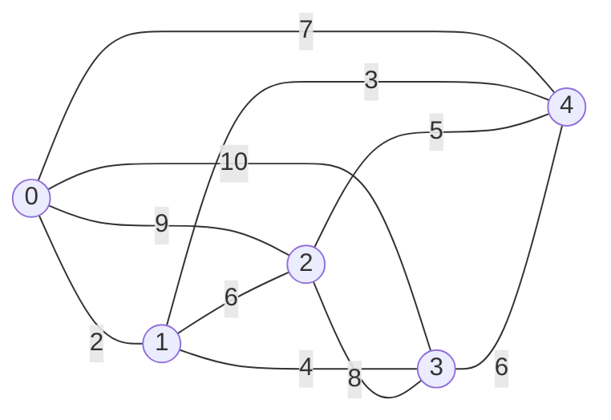
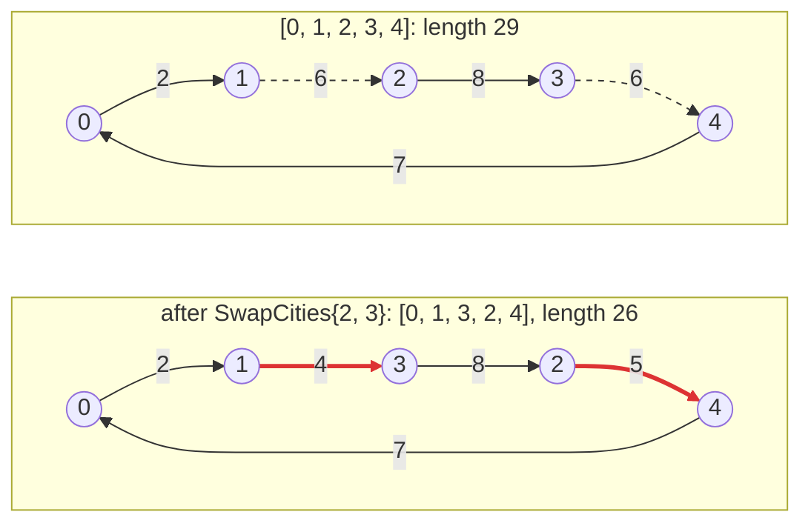

# Quick start

This page builds and runs a complete local search in one file: First
Improvement with swap moves for the symmetric Travelling Salesperson Problem
(TSP). It goes through the program piece by piece; the
[tutorial](tutorial/README.md) then extends it one chapter at a time and adds
the rest of the framework.

## Requirements

- a C++23 compiler: CI covers GCC 15 and 16, Clang 22 and 23 (libstdc++ and
  libc++) and AppleClang; AppleClang needs Xcode 26 or later and a macOS
  deployment target of 26.0 or later, for the floating-point `std::from_chars`
  of its libc++ (CMake stops with a message otherwise);
- CMake 3.25+;
- EasyLocal, either installed (`cmake --install <build> --prefix <prefix>`) or
  added to your project with `add_subdirectory`.

EasyLocal Core is header-only and has no dependencies beyond the standard
library.

## The problem

A salesperson must visit a set of cities, each exactly once, and come back to
the city they started from. The distance between every pair of cities is known
and is the same in both directions (the problem is *symmetric*). The task is to
find the order of the visits that makes the round trip as short as possible.

The example has five cities, numbered from 0 to 4. Each edge of the graph
carries the distance between its two cities:



The same distances as a matrix, where row `a`, column `b` is the distance from
city `a` to city `b`:

|       | 0  | 1 | 2 | 3  | 4 |
| ----- | -- | - | - | -- | - |
| **0** | 0  | 2 | 9 | 10 | 7 |
| **1** | 2  | 0 | 6 | 4  | 3 |
| **2** | 9  | 6 | 0 | 8  | 5 |
| **3** | 10 | 4 | 8 | 0  | 6 |
| **4** | 7  | 3 | 5 | 6  | 0 |

The shortest round trip has length 26, reached by two tours (each
also in the opposite direction): 0 → 1 → 3 → 2 → 4 → 0 (2 + 4 + 8 + 5 + 7) and
0 → 1 → 3 → 4 → 2 → 0 (2 + 4 + 6 + 5 + 9).

## Solutions and moves

**A solution** is a tour, written as the sequence of the cities in the order
they are visited: `[0, 1, 2, 3, 4]` means 0 → 1 → 2 → 3 → 4 and back to 0. Its
length is the sum of the five edges it uses, 2 + 6 + 8 + 6 + 7 = 29.

A sequence is a valid tour only if it is a *permutation* of 0, 1, ..., n − 1:
exactly n positions, with every city appearing once. `[0, 1, 1, 3, 4]` (city 1
twice, city 2 never) and `[0, 1, 2]` (too short) are not tours.

**A move** changes a solution into a nearby one; local search repeatedly looks
at the moves of the current solution and applies one. Here the move is
`SwapCities{i, j}`: exchange the cities visited at positions `i` and `j`. A swap
of two cities always yields another permutation, so it turns a valid tour into
a valid tour. For example, `SwapCities{2, 3}` exchanges the third and fourth
city of `[0, 1, 2, 3, 4]`:



The edges 1–2 and 3–4 (dashed) leave the tour, the edges 1–3 and 2–4 (red)
enter it: the tour gets 3 shorter and, here, optimal. Swapping two cities that
are not next to each other in the tour replaces four edges instead of two.

The *neighborhood* of a tour is the set of all its swap moves: one for each
pair of positions `i < j`, 10 for five cities.

## The program, piece by piece

The program is a single file, `main.cpp`. It starts with three plain types,
with no framework base class: the **Input** (the instance), the **Solution**
and the **Move**.

<!-- snippet: quickstart/main.cpp:problem -->
```cpp
// Input: the instance, immutable during the search.
struct Tsp
{
    // distance[a][b] is the distance between cities a and b (symmetric).
    std::vector<std::vector<double>> distance;

    std::size_t cities() const
    {
        return distance.size();
    }
};

// Solution: the state the search modifies. order[k] is the k-th city visited;
// after the last city the tour returns to order[0].
struct Tour
{
    std::vector<std::size_t> order;
};

// Move: a local change of a Tour. It exchanges the cities visited at
// positions i and j, with i < j.
struct SwapCities
{
    std::size_t i;
    std::size_t j;
};
```

The distance matrix is a vector of rows, so the distance between `a` and `b` is
`distance[a][b]`. The Input is built once and never modified during the search.

### The SolutionManager

The **SolutionManager** knows what a solution is: how to build one and which
ones are valid.

<!-- snippet: quickstart/main.cpp:solution-manager -->
```cpp
// SolutionManager: how to build a solution and which solutions are valid.
class TourManager : public easylocal::solution_manager_base<Tsp, Tour>
{
public:
    using solution_manager_base::solution_manager_base;

    // The cities in index order: 0, 1, ..., n - 1.
    Tour initial_solution() const
    {
        Tour tour{std::vector<std::size_t>(input().cities())};
        std::ranges::iota(tour.order, std::size_t{0});
        return tour;
    }

    // A tour is valid when it is a permutation of 0, 1, ..., n - 1: it has
    // n positions and visits every city exactly once.
    bool is_valid(const Tour& tour) const
    {
        return std::ranges::is_permutation(
            tour.order,
            std::views::iota(std::size_t{0}, input().cities()));
    }
};
```

- Deriving from `easylocal::solution_manager_base<Tsp, Tour>` gives the class
  its constructor and `input()`, the instance it works on.
- `initial_solution()` builds the tour that visits the cities in index order.
- `is_valid` checks the permutation property: `std::ranges::is_permutation`
  compares `tour.order` with the sequence `0, 1, ..., n − 1` (built by
  `std::views::iota` without storing it), and is true only when both have the
  same length and the same elements. EasyLocal calls it in debug builds, to
  catch a move that breaks a tour.

### The cost

A **cost component** computes one term of the objective, here the length of
the tour:

<!-- snippet: quickstart/main.cpp:cost -->
```cpp
// Cost component: one term of the objective, here the length of the tour.
class TourLength
{
public:
    explicit TourLength(const Tsp& input) : input_{input} {}

    double evaluate(const Tour& tour) const
    {
        const auto n = tour.order.size();
        double length = 0.0;
        for (std::size_t k = 0; k < n; ++k)
        {
            const auto from = tour.order[k];
            const auto to =
                tour.order[(k + 1) % n]; // the last city goes back to the first
            length += input_.distance[from][to];
        }
        return length;
    }

private:
    const Tsp& input_;
};
```

The component receives the Input in its constructor and keeps a reference to
it, `input_`. The modulo `(k + 1) % n` makes the last city connect back to the
first one. With a single component, its value is the cost of the solution.

### The neighborhood

The **NeighborhoodExplorer** knows the moves: which ones exist, whether one is
valid and how it changes a solution.

<!-- snippet: quickstart/main.cpp:neighborhood -->
```cpp
// NeighborhoodExplorer: which moves exist and how they change a solution.
class SwapExplorer : public easylocal::neighborhood_explorer_base<TourManager, SwapCities>
{
public:
    using neighborhood_explorer_base::neighborhood_explorer_base;

    // Every pair of positions i < j, one move at a time: the generator hands a
    // move to the runner at each co_yield and resumes when it asks for the
    // next one, so the neighborhood is never stored in memory.
    easylocal::generator<SwapCities> moves(const Tour& tour) const
    {
        const auto n = tour.order.size();
        for (std::size_t i = 0; i < n; ++i)
            for (std::size_t j = i + 1; j < n; ++j)
                co_yield SwapCities{i, j};
    }

    bool is_valid(const Tour& tour, const SwapCities& move) const
    {
        return move.i < move.j && move.j < tour.order.size();
    }

    void make_move(Tour& tour, const SwapCities& move) const
    {
        std::swap(tour.order[move.i], tour.order[move.j]);
    }
};
```

- `moves(tour)` lists the moves of the neighborhood, every pair `i < j`. It is
  a *generator*: each `co_yield` hands one move to the algorithm and pauses
  until the algorithm asks for the next one. The neighborhood is never stored,
  and First Improvement, which stops at the first move that improves the cost,
  never generates the rest. `easylocal::generator<T>` is `std::generator<T>`
  where the standard library provides it.
- `is_valid(tour, move)` says whether a move can be applied to a tour.
- `make_move(tour, move)` applies it: one `std::swap`.

The explorer has only what First Improvement uses. Other algorithms need other
members, for example `random_move` for Simulated Annealing; the
[tutorial](tutorial/03-neighborhood.md) adds them.

### The instance

`main` builds the instance of the diagram above, one matrix row per line:

<!-- snippet: quickstart/main.cpp:instance -->
```cpp
const Tsp tsp{
    .distance =
        {
            {0, 2, 9, 10, 7},
            {2, 0, 6, 4, 3},
            {9, 6, 0, 8, 5},
            {10, 4, 8, 0, 6},
            {7, 3, 5, 6, 0},
        },
};
```

### Assembling and running the search

A **runner** is a search algorithm together with the services it uses. It is
written as a pipeline of *recipes*:

<!-- snippet: quickstart/main.cpp:runner -->
```cpp
// A runner is assembled from recipes: descriptions of the services that
// are built later, by bind, when the Input is known.
auto runner =
    // The algorithm and its parameters: the defaults run First Improvement
    // until a local optimum, with no budget on the evaluations.
    easylocal::make_runner<easylocal::runners::FirstImprovement>(
        easylocal::runners::FirstImprovementParameters{})
    // The SolutionManager with its cost: the parentheses make one recipe
    // of the manager and the cost component attached to it.
    | (easylocal::solution_manager<TourManager>()
        | easylocal::component<TourLength>())
    // The neighborhood: the moves the algorithm explores.
    | easylocal::neighborhood<SwapExplorer>();

// bind builds TourManager, TourLength and SwapExplorer for this instance
// and returns the bound runner; run searches from the initial tour.
auto search = runner.bind(tsp);
const auto result = search.run(search.initial_solution());
```

1. `make_runner<FirstImprovement>(parameters)` chooses the algorithm. First
   Improvement scans the moves of the current tour, applies the first one that
   lowers the cost, and starts again from the new tour; it stops at a *local
   optimum*, a tour none of whose moves improves it.
2. `solution_manager<TourManager>() | component<TourLength>()` describes the
   SolutionManager and the cost it computes. The parentheses make them one
   piece: the cost component belongs to the SolutionManager, not to the runner.
3. `neighborhood<SwapExplorer>()` describes the moves the algorithm explores.
4. The recipes contain no instance: `TourLength` and the other classes need a
   `Tsp` to be built, and the runner does not have one yet. `runner.bind(tsp)`
   builds them for this instance and returns the *bound* runner, `search`.
   The same `runner` can be bound to many instances.
5. `search.run(solution)` runs the algorithm from a solution, here
   `search.initial_solution()`, and returns the result: the final solution,
   its cost and statistics such as the number of evaluations.

## The whole program

Download it, with the `CMakeLists.txt` of the next section:
[main.cpp](downloads/quickstart/main.cpp){: download="main.cpp" },
[CMakeLists.txt](downloads/quickstart/CMakeLists.txt){: download="CMakeLists.txt" }, or both in
[quickstart.zip](downloads/quickstart/quickstart.zip){: download="quickstart.zip" }.

<!-- snippet: quickstart/main.cpp -->
```cpp
// Quick start: a swap-move First Improvement for the symmetric TSP.
// This is the program of docs/quick-start.md; it is built and run as a test.
#include <easylocal/easylocal.hpp>

#include <algorithm>
#include <cstddef>
#include <iostream>
#include <numeric>
#include <ranges>
#include <utility>
#include <vector>

// Input: the instance, immutable during the search.
struct Tsp
{
    // distance[a][b] is the distance between cities a and b (symmetric).
    std::vector<std::vector<double>> distance;

    std::size_t cities() const
    {
        return distance.size();
    }
};

// Solution: the state the search modifies. order[k] is the k-th city visited;
// after the last city the tour returns to order[0].
struct Tour
{
    std::vector<std::size_t> order;
};

// Move: a local change of a Tour. It exchanges the cities visited at
// positions i and j, with i < j.
struct SwapCities
{
    std::size_t i;
    std::size_t j;
};

// SolutionManager: how to build a solution and which solutions are valid.
class TourManager : public easylocal::solution_manager_base<Tsp, Tour>
{
public:
    using solution_manager_base::solution_manager_base;

    // The cities in index order: 0, 1, ..., n - 1.
    Tour initial_solution() const
    {
        Tour tour{std::vector<std::size_t>(input().cities())};
        std::ranges::iota(tour.order, std::size_t{0});
        return tour;
    }

    // A tour is valid when it is a permutation of 0, 1, ..., n - 1: it has
    // n positions and visits every city exactly once.
    bool is_valid(const Tour& tour) const
    {
        return std::ranges::is_permutation(
            tour.order,
            std::views::iota(std::size_t{0}, input().cities()));
    }
};

// Cost component: one term of the objective, here the length of the tour.
class TourLength
{
public:
    explicit TourLength(const Tsp& input) : input_{input} {}

    double evaluate(const Tour& tour) const
    {
        const auto n = tour.order.size();
        double length = 0.0;
        for (std::size_t k = 0; k < n; ++k)
        {
            const auto from = tour.order[k];
            const auto to =
                tour.order[(k + 1) % n]; // the last city goes back to the first
            length += input_.distance[from][to];
        }
        return length;
    }

private:
    const Tsp& input_;
};

// NeighborhoodExplorer: which moves exist and how they change a solution.
class SwapExplorer : public easylocal::neighborhood_explorer_base<TourManager, SwapCities>
{
public:
    using neighborhood_explorer_base::neighborhood_explorer_base;

    // Every pair of positions i < j, one move at a time: the generator hands a
    // move to the runner at each co_yield and resumes when it asks for the
    // next one, so the neighborhood is never stored in memory.
    easylocal::generator<SwapCities> moves(const Tour& tour) const
    {
        const auto n = tour.order.size();
        for (std::size_t i = 0; i < n; ++i)
            for (std::size_t j = i + 1; j < n; ++j)
                co_yield SwapCities{i, j};
    }

    bool is_valid(const Tour& tour, const SwapCities& move) const
    {
        return move.i < move.j && move.j < tour.order.size();
    }

    void make_move(Tour& tour, const SwapCities& move) const
    {
        std::swap(tour.order[move.i], tour.order[move.j]);
    }
};

int main()
{
    const Tsp tsp{
        .distance =
            {
                {0, 2, 9, 10, 7},
                {2, 0, 6, 4, 3},
                {9, 6, 0, 8, 5},
                {10, 4, 8, 0, 6},
                {7, 3, 5, 6, 0},
            },
    };

    // A runner is assembled from recipes: descriptions of the services that
    // are built later, by bind, when the Input is known.
    auto runner =
        // The algorithm and its parameters: the defaults run First Improvement
        // until a local optimum, with no budget on the evaluations.
        easylocal::make_runner<easylocal::runners::FirstImprovement>(
            easylocal::runners::FirstImprovementParameters{})
        // The SolutionManager with its cost: the parentheses make one recipe
        // of the manager and the cost component attached to it.
        | (easylocal::solution_manager<TourManager>()
            | easylocal::component<TourLength>())
        // The neighborhood: the moves the algorithm explores.
        | easylocal::neighborhood<SwapExplorer>();

    // bind builds TourManager, TourLength and SwapExplorer for this instance
    // and returns the bound runner; run searches from the initial tour.
    auto search = runner.bind(tsp);
    const auto result = search.run(search.initial_solution());

    std::cout << "length " << result.cost << " after " << result.evaluations
              << " evaluations\n";
}
```

It is the source of `examples/quickstart/main.cpp`, which is built and run with
the test suite.

## Build and run

Create a folder with two files: `main.cpp`, containing the program above, and
`CMakeLists.txt`, containing:

<!-- snippet: quickstart/standalone/CMakeLists.txt -->
```cmake
cmake_minimum_required(VERSION 3.25)
project(tsp LANGUAGES CXX)

find_package(EasyLocal CONFIG REQUIRED COMPONENTS Core)

add_executable(tsp main.cpp)
target_link_libraries(tsp PRIVATE EasyLocal::Core)
```

Then, from that folder, configure, build and run, with
`CMAKE_PREFIX_PATH` pointing to where EasyLocal is installed:

```sh
cmake -S . -B build -DCMAKE_PREFIX_PATH=/path/to/easylocal-prefix
cmake --build build
./build/tsp
```

If EasyLocal is not installed, replace the `find_package` line with
`add_subdirectory(/path/to/easylocal easylocal)`, which builds it as part of
your project, and drop `-DCMAKE_PREFIX_PATH` from the first command. Your
project's install then leaves EasyLocal out, unless you configure it with
`-DEASYLOCAL_INSTALL=ON`.

The program prints:

```text
length 26 after 14 evaluations
```

The search reached the optimal length from the initial tour of length 29,
evaluating 14 tours: the initial one and 13 moves.

## Next steps

- [Tutorial](tutorial/README.md): the same problem, extended chapter by
  chapter: random moves, a faster neighborhood with incremental evaluation,
  other algorithms, solvers, configuration and tools.
- [Reference](reference/README.md): the contract of each component.
