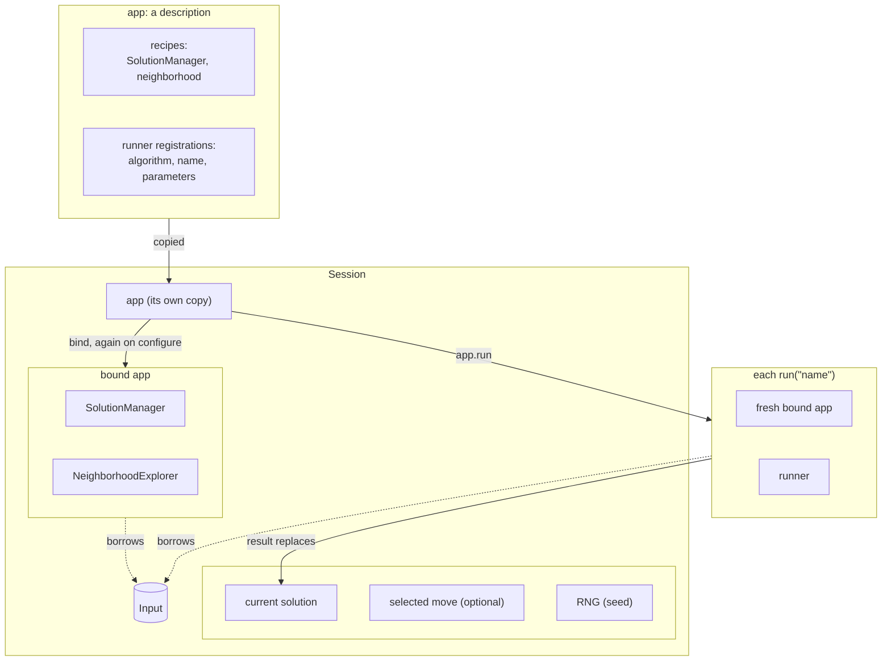
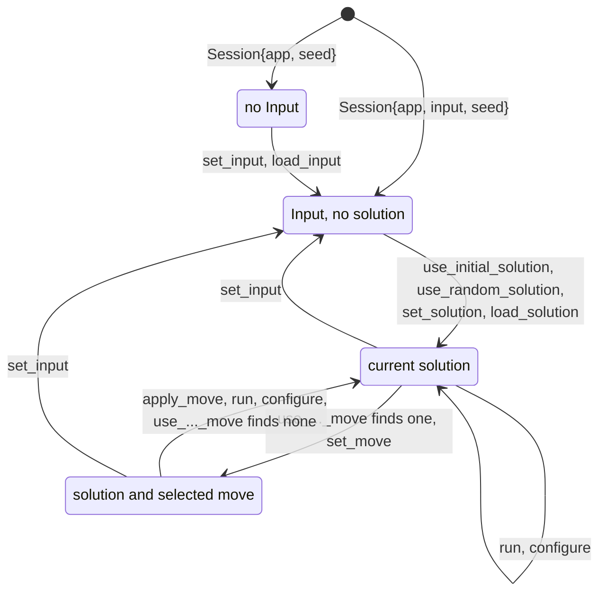

# Apps and tools

`<easylocal/app/app.hpp>`, `app/check.hpp`, `app/session.hpp`,
`app/run_parameters.hpp`; adapters
`<easylocal/adapters/tui.hpp>`, `<easylocal/adapters/rest.hpp>`

An **app** names a problem graph (SolutionManager and neighborhood recipes) and
the runners available on it. Tools consume apps.

## Building an app

```cpp
auto application = app("name")
    .with_solution_manager(sm)
    .with_neighborhood(nhe)
    .with_runner<Algorithm>("runner-name", parameters);   // parameters optional

// equivalently
auto application = app("name") | sm | nhe | runner<Algorithm>("runner-name", parameters);
```

A registered algorithm must expose a default-constructible `parameters_type`
and be constructible from it. The same algorithm may be registered under
several names.

| Member | Purpose |
| --- | --- |
| `name()` | the app name |
| `runner_config<A>()`, `runner_config<A>("name")` | the stored parameters |
| `runner_name<A>()` | the registered name |
| `configuration()` | the app's parameters as a `config::parameter_set`: `cost.*`, `neighborhood.*` and `runners.<name>.*` |
| `bind(input)` | the *bound app*: services built once for `input`, which it borrows (a temporary Input is rejected) |
| `run("name", input, solution, rng, options...)` | run the runner registered under a name; `std::optional<named_run_result>`, empty for an unknown name |
| `run<A>(input, solution, args...)`, `run_at<I>(...)` | run by algorithm or by registration index |
| `run_at_with_rng<I>(input, solution, rng, options...)` | run by index; `rng` goes to stochastic algorithms only |
| `make_runner<A>([name])`, `make_solver<Solver, A>([name,] config)` | standalone runner or solver |
| `for_each_runner_registration[_indexed](visitor)` | iterate registrations (adapters) |

The `run` members bind the app to the Input for that run only, with the
current runner parameters. A bound app (`bind`) offers
`solution_manager()`, `neighborhood()`, `input()`, `runner<A>()`,
`run<A>(solution, args...)` and `run_at<I>(...)` on services built once.

`named_run_result{solution, cost}` keeps what every runner result provides
(`search_result_for`): a runner chosen by name may be any algorithm, built-in
or your own, each with its own result type.

## Tools

| Tool | Purpose |
| --- | --- |
| `check(app, input[, solution]) -> app_check_report` | contract checks of the composed problem; `print_report` |
| `cli::run(app, argc, argv[, options]) -> int` | the app as a command-line program (`<easylocal/app/cli.hpp>`): see below |
| `tui::run(app, options)`, `tui::run_launcher(options, apps...)` | interactive terminal tester (TUI component, FTXUI); `tui::options` |
| `rest::blueprint(prefix, app, codec, options)` | Crow blueprint: asynchronous runs, status, cancellation, solutions (REST component); see [REST](../rest.md) |

Tools give stochastic runners an RNG they own, from a configurable seed: the
TextUI `seed` option (also editable on its Run page) and REST's per-run `seed`
(default `blueprint_options::seed + run id`). `run("name", ...)` passes the RNG
to the algorithm only if it takes one, so deterministic runners ignore it.

The TextUI edits the app's parameters in modal windows: `G` on the Run page
opens the selected runner's (`runners.<name>.*`) before running it, `P` the
problem's (`cost.*`, `neighborhood.*`). Values are checked before anything
changes and stay for the rest of the session. Its *Target cost* field, when
filled, stops each run at the first solution that reaches it; below it, the
current cost is shown in the same syntax.

`cli::run` parses the command line and a `--config` file with
`config::load_and_apply`: its own block `cli::parameters` at the root
(`instance`, `seed`, `runner`, `start`, `solution`, `output`, `target`,
`report`), the
app's `configuration()`, and `options.parameters`, the program's own set. It
then builds a `Session` with the seed, loads the Input, takes the starting
solution (`--solution`, else `--start`: `random` by default when the problem
has `random_solution`, `initial` otherwise), runs the runner by name, with
`stop_at` when `--target` is set, and writes `cost`, `time`, with `--report`
the session's `cost_report()` (a line `component <name> <value>` for each
component, followed by its description, indented), and the solution
(or saves it to `--output`) to `options.out`; errors go to `options.err`. It
returns 0, 2 for an invalid command line or an unknown runner, 1 when the run
throws. It requires the `read_input` hook, and the solution hooks only when the
corresponding switches are used.

A program that reads its configuration from the command line itself adds
`easylocal::RunParameters` for the target, under a prefix of its choice:

```cpp
easylocal::RunParameters run;
configuration.add("run", run);                       // --run.target=0
// ... once the Input is loaded:
if (!run.target.empty())
    session.run("sa", easylocal::stop_at(session.read_cost(run.target)));
```

`run.target_cost<Cost>(input)` gives the target as a `std::optional<Cost>`,
empty when none is set, for programs that run a runner or a solver directly;
its errors name the field.

The target stays text until the Input is known, because a problem may read
its costs with its own `read_cost`. A program that runs a runner without a
Session reads it with `easylocal::read_cost<Cost>(input, text)`, which the
Session also uses: the problem's `read_cost` when it has one, else
`cost::from_text`; `easylocal::readable_cost<Input, Cost>` tells whether
either applies.

## Sessions

A `Session` (`<easylocal/app/session.hpp>`) is an app at work on one Input: an
owned Input, the app bound to it, a current solution, a selected move and an
RNG, with the commands that change them. It is how a program runs an app
headless, and the model of an interactive frontend: the TextUI is a view on
it, and a GUI or a web frontend would be another.



| Constructor | |
| --- | --- |
| `Session{app, input, seed}` | a session on `input`, which it owns; another Input is another session |
| `Session{app, std::shared_ptr<const Input>, seed}` | a session on an Input it shares with other owners, without copying it |
| `Session{app[, seed]}` | a session without an Input yet, for frontends that load one (`set_input`, `load_input`) |

| Commands | |
| --- | --- |
| Input | `set_input`, `load_input` (the I/O hooks of [Problem model](problem-model.md#optional-hooks)), `input`, `has_input` |
| Solution | `use_initial_solution`, `use_random_solution(rng)`, `set_solution`, `load_solution`, `save_solution`, `solution`, `is_valid`, `evaluate`, `check()` |
| Move | select with `use_first_move`, `use_next_move`, `use_first_improving_move`, `use_best_move`, `use_random_move(rng)` or `set_move`; then `move_is_valid`, `evaluate_move`, `evaluate_move_fully`, `move_evaluation_matches_full`, `apply_move` |
| Neighborhood | `neighborhood_preview`, `neighborhood_statistics`, `check_neighborhood_costs`, `check_move_independence` (needs `Solution::operator==`), `check_random_move_distribution(rng)` (needs `Move::operator==`) |
| Runners | `runner_names`, `run("name", options...)` (replaces the current solution; options are `with(control, tracer)`) |
| Costs | `read_cost(text)`: a cost written as text, such as a target, by the problem's `read_cost` or `cost::from_text`; `cost_report()`: each cost component on the current solution, in the order of the recipe, as `component_report{name, value, description}`: its `name()` or `#<position>`, its own value without weights, and its `describe(solution)` text, empty without it |
| Parameters | `configuration()`, the app's; `configure(text_overrides)` applies them all or none and, when the cost or the neighborhood changes, rebuilds the bound services |

The commands move the session through these states; a new Input drops the
solution and the move, a new solution or a run drops the move:



The selections and `run` return `false` when there is nothing to select or no
runner with that name, and are `[[nodiscard]]`. `run` uses fresh services and
the current runner parameters, like `app.run`, and executes on the calling
thread. The REST service gives every run a Session of its own and calls `run`
on a worker thread, with `with(control)` for progress and cancellation. The
TextUI, which keeps reading its Session while a runner works, runs it with
`app.run("name", ...)` on copies of the app, Input and solution instead.

## Design choices

- **Fresh services per run.** `app.run` binds new services, so concurrent runs
  share only the immutable Input and no locking is needed.
- **Registration by class and name.** The class is the key, the name tells
  registrations of the same class apart and is what tools show.
- **One way to run by name.** `app.run("name", ...)` is the single place where
  a name selects a runner; the TextUI, the REST service and `Session` use it.
- **Adapters are optional components** outside Core, meant to become separate
  projects once the API is stable.
