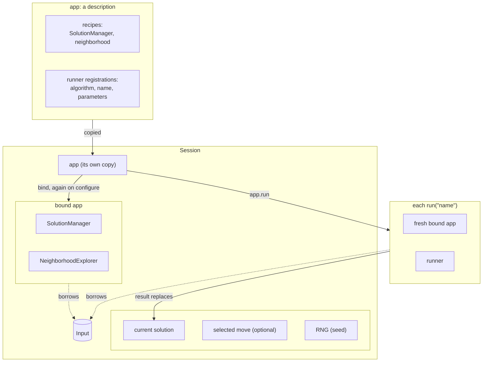
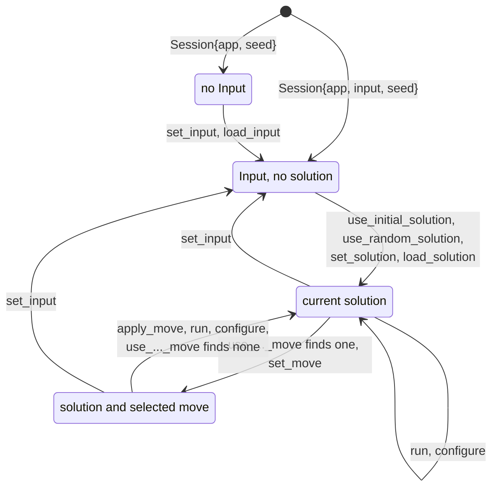

# Apps and tools

`<easylocal/app/app.hpp>`, `app/check.hpp`, `app/session.hpp`,
`app/run_parameters.hpp`; adapters
`<easylocal/adapters/tui.hpp>`, `<easylocal/adapters/rest.hpp>`

An **app** names a problem graph (SolutionManager and neighborhood recipes) and
the runners available on it. Tools consume apps.

## Building an app

```cpp
auto application = app("name")
    .with_solution_manager(sm)
    .with_neighborhood(nhe)
    .with_runner<Algorithm>("runner-name", parameters);   // parameters optional

// equivalently
auto application = app("name") | sm | nhe | runner<Algorithm>("runner-name", parameters);
```

A registered algorithm must expose a default-constructible `parameters_type`
and be constructible from it. The same algorithm may be registered under
several names.

A runner runs on the app's neighborhood, unless it brings its own, the third
argument of `runner` (or of `with_runner`):

```cpp
auto application = app("tsp") | sm | two_opt
    | runner<FirstImprovement>("fi")
    | runner<FirstImprovement>("fi-swap", {}, neighborhood<Swap>() | delta<Length, SwapDelta>());
```

Its neighborhood is built over the app's SolutionManager when the app is bound,
next to the app's own, and its parameters are under
`runners.<name>.neighborhood.*`. The registration is checked at compile time:
the neighborhood explores the app's Solution and the algorithm runs on it.
`check(app, ...)` checks every neighborhood, the runners' own included; the
Session, the TextUI and REST show and apply the moves of the app's
neighborhood. `make_runner<A>("name")` requires the runners of `A` to run on
neighborhoods of the same recipe type.

The names of the runners and pipelines of an app must be non-empty, distinct,
and made of letters, digits, `_` and `-`: each is the key of a registration
and a segment of its parameter paths (`runners.<name>.*`). `configuration()`
and `bind()` throw `std::invalid_argument` otherwise, and `check(app, ...)`
reports it as `registration names`.

### Pipelines

An app also registers [pipelines](solvers.md#pipeline), beside its runners and
under names of the same list:

```cpp
using namespace easylocal::solvers;
auto application = app("tsp") | sm | nhe
    | runner<runners::FirstImprovement>("fi")
    | pipeline("cascade",
          stage("feasible", descent) & until_feasible() & attempts(5),
          stage("climb", climbing));
// or pipeline("cascade", (stage(...) & ...) | stage(...)), or .with_pipeline(...)
```

Each stage is a runner with its own recipes; the stages must have the app's
Input and Solution, and the last one the app's cost (checked at compile time).
For every tool a pipeline is one more runner: it is listed among the runners,
run by name from the current solution (`pipeline.run(input, solution, rng)`,
so its first stage's attempts all start from that solution), and configured
under `runners.<name>.<stage>.*` (`--runners.cascade.climb.search.*`,
`runners.cascade.feasible.attempts`).

`app("name")` returns an `App`, and each `|` a new `App` type, which spells
out all its recipes: let `auto` deduce it, or a function that returns it. The
name of a registration is its key: the members below find a runner by it,
never by its algorithm type or its position, so an algorithm may be
registered twice (`"sa-fast"`, `"sa-slow"`).

| Member of `App` | Purpose |
| --- | --- |
| `name()` | the app name |
| `runner_names()` | the names of the runners and pipelines, in the order of registration |
| `runner_parameters<A>("name")` | the stored parameters of the runner of algorithm `A` registered as `name`; `std::invalid_argument` for an unknown name |
| `configuration()` | the app's parameters as a `config::parameter_set`: `cost.*`, `neighborhood.*` and `runners.<name>.*` |
| `bind(input)` | the `BoundApp`: services built once for `input`, which it borrows (a temporary Input is rejected) |
| `run("name", input, solution, rng, options...)` | run the runner or pipeline registered under a name; `std::optional<named_run_result>`, empty for an unknown name |
| `make_runner<A>("name")` | a standalone `Runner` with that runner's parameters and the app's recipes, for a solver: `make_solver<Solver>(application.make_runner<A>("name"), config)` |
| `check_registration_names()` | throws `std::invalid_argument` unless the names are valid |

`run` binds the app to the Input for that run only, with the current runner
parameters: the app and the Input may be shared by concurrent runs. A
`BoundApp` offers `input()`, `solution_manager()`, `neighborhood()` and
`run("name", solution, rng, options...)` on services built once, whose runners
keep their state from one run to the next. `Runner::bind` returns a
`BoundRunner`, with `input()`, `solution_manager()`, `initial_solution()`,
`random_solution(rng)`, `better(a, b)` and `run(solution, args...)`.

`named_run_result{solution, cost, effort}` keeps what every runner result
provides (`search_result_for`): a runner chosen by name may be any algorithm,
built-in or your own, each with its own result type. `effort` is a
`run_effort{evaluations, iterations, termination}` when the result has those
members, as `search_result` does, and empty otherwise.

## Tools

| Tool | Purpose |
| --- | --- |
| `check(app, input[, solution]) -> app_check_report` | contract checks of the composed problem; `print_report` |
| `cli::run(app, argc, argv[, options]) -> int` | the app as a command-line program (`<easylocal/app/cli.hpp>`): see below |
| `tui::run(app, options)`, `tui::run_launcher(options, apps...)` | interactive terminal tester (TUI component, FTXUI); `tui::options` |
| `rest::blueprint(prefix, app, codec, options)` | Crow blueprint: asynchronous runs, status, cancellation, solutions (REST component); see [REST](../rest.md) |

`tui::run_launcher(options, apps...)` opens a list of apps over the same
problem. The launcher owns the Input, read from `options.tester.input_path`
when it is set, and the current solution: its first entry, *Input and
solution*, is a tester with the Input/Output page only, which loads and saves
them; each app opens on them in the complete tester, and what a tester leaves,
loaded or computed, becomes the shared state. Each app keeps its own session
while the launcher runs: its runner and problem parameters and its seed stay
when it is left and opened again. The apps must have the same SolutionManager
recipe, cost included, which a `static_assert` checks; they differ in the
neighborhood and the runners.

Tools give stochastic runners an RNG they own, from a configurable seed: the
TextUI `seed` option (also editable on its Run page) and REST's per-run `seed`
(default `blueprint_options::seed + run id`). Each run of a `Session`, and so
of every tool, gets a generator of its own, seeded with one draw of the
session's RNG: the same seed and the same commands give the same runs in every
frontend (the conditions are in [Stability](../stability.md#reproducibility)).
`run("name", ...)` passes the RNG to the algorithm only if it takes one, so
deterministic runners ignore it.

The TextUI edits the app's parameters in modal windows: `G` on the Run page
opens the selected runner's (`runners.<name>.*`) before running it, `P` the
problem's (`cost.*`, `neighborhood.*`). Values are checked before anything
changes and stay for the rest of the session. Its *Target cost* field, when
filled, stops each run at the first solution that reaches it; below it, the
current cost is shown in the same syntax. Its *Stop after* row has two
fields: *seconds*, when filled, stops each run after that many seconds (the
progress shows the time elapsed); *evaluations* does the same with a number
of evaluations. The result of the last run is shown below the controls and in
the status line: the costs before and after, why the run ended and its
evaluations, such as "(time limit reached, 812 evaluations)", when the runner
reports them. In a terminal too small for a page, the page scrolls to the
focused control (Tab, arrows).

`cli::run` parses the command line and a `--config` file with
`config::load_and_apply`: its own block `cli::parameters` at the root
(`instance`, `seed`, `runner`, `start`, `solution`, `output`, `target`,
`timeout`, `max_evaluations`, `report`), the
app's `configuration()`, and `options.parameters`, the program's own set;
`options.defaults`, a `cli::parameters`, gives the values of its switches
before the command line. It
then builds a `Session` with the seed, loads the Input, takes the starting
solution (`--solution`, else `--start`: `random` by default when the problem
has `random_solution`, `initial` otherwise), runs the runner by name, with
`stop_at` when `--target` is set, `timeout` when `--timeout` is (seconds) and
`max_evaluations` when `--max_evaluations` is, and writes `cost`, `time`, the session's
`last_run_effort()` when the runner reports it (`iterations`, `evaluations`,
`termination`), with `--report`
the session's `cost_report()` (a line `component <name> <value>` for each
component, followed by its description, indented), and the solution
(or saves it to `--output`) to `options.out`; errors go to `options.err`. It
returns 0, 2 for an invalid command line, an unknown runner or a `--solution`
that is not valid for the Input (`error: solution: ...`), 1 when the run
throws (`error: unknown exception` for what is not a `std::exception`). It requires the `read_input` hook, and the solution hooks only when the
corresponding switches are used.

### Tuning with irace

`<easylocal/app/tuning.hpp>`; tutorial: [chapter 11](../tutorial/11-apps-and-tools.md#tuning-the-parameters-with-irace).

`cli::run` also reads the block `easylocal::TuningParameters` under `tuning`:

| Switch | |
| --- | --- |
| `--tuning.irace=DIR` | write an irace scenario to `DIR`, which it creates, and exit without loading the Input |
| `--tuning.print=cost`, `cost_time` | print only the cost as one number (`scalar_cost`), and the running time in seconds after it with `cost_time` |
| `--tuning.hard_weight=W` | the weight of a hard cost over a soft one in that number; 10^9 by default |

`options.tuning`, a vector of `tuning_range{path, domain}`, gives the values
to try for parameters instead of the domains of their schemas; a range must
lie within the declared domain and name a parameter of the app or of
`options.parameters`, or the export fails with status 2.

`write_irace_stub(irace_stub) -> irace_stub_result` writes the scenario:

- `parameters.txt`: the parameters with a finite domain, as `name "--path=" type
  (values)`, where `name`, the irace identifier, is the path with every
  character but letters, digits, `.` and `_` turned into `_` (a numeric suffix
  tells apart two paths that would get the same identifier, and `runner` is
  reserved); conditions, `[forbidden]` and `configurations.txt` use the
  identifiers, and `configurations.txt` maps them back through the switch;
  with `r`, `i` (`,log` on a logarithmic range), `o` for a set of numbers and `c` for text and the runner; real values have irace's 4 digits
  after the point, or as many as a bound needs (at most 15, written as
  `digits` in a `[global]` section), and an open real bound moves inward by one such
  step, an open integer bound to the nearest integer inside the range. With several runners a categorical `runner` is
  added and each `runners.<name>.*` gets the condition `| runner == "<name>"`;
  a runner chosen with `--runner` is the only one written. A field's
  `only_if` condition becomes an irace condition when it names tuned
  parameters, those that are not tuned replaced by their values; when it names
  none, it is decided at once, and a parameter whose condition is false is
  commented out as inactive. Each `require` that names a tuned parameter
  becomes a `[forbidden]` expression, `!(...)`, after its message; with values
  in place of some names, the expression with every name follows as a comment,
  and so does the condition of a commented-out line. The built-in runners
  and policies state every rule between their parameters (a minimum not above
  its maximum) as a `require`, so irace samples no configuration they
  reject. The other
  parameters, whose domain has no upper bound or is any value, are commented
  out, with a range of a factor of ten around a positive value, within the
  lower bound, to start from, or `(LOW, HIGH)` with the lower bound when it has
  one; lists, paths, text and
  `unlimited` limits are noted, not written. `cost.*` is never written: it
  defines the cost that irace compares.
- `fixed.conf`: the parameters the command line changed when the stub was
  written (but `instance`, `seed`, `solution`, `output`, `report`,
  `tuning.irace` and `tuning.print`; `tuning.hard_weight` stays, so that every
  run weighs the hard cost the same), with paths made absolute, read by each run with `--config`;
  the tuned values override them.
- `target-runner`: a shell script that runs the program, by its absolute path,
  with `--config fixed.conf --tuning.print=cost --instance=... --seed=...` and
  the candidate's switches; a bound passed by irace is ignored. It does not run
  on Windows.
- `instances.txt`, `scenario.txt`: stubs, with the program's instance and a
  budget of 1000 runs.
- `configurations.txt`: the current values as a first configuration, `NA` for
  the parameters of the runners that are not the first and for those whose
  condition is false.

The files that exist are kept, so that the user edits them; only
`configurations.txt` is rewritten, each time from `parameters.txt` as it is on
disk (up to a `[global]` or `[forbidden]` section), with each value moved into
its range when it lies outside (`moved` lists them; `unlimited` moves to the
upper bound). A parameter of
`parameters.txt` that the program does not have is an error.

`scalar_cost(input, cost, hard_weight) -> double` is the number irace compares:
the problem's `scalar_cost(const Input&, const Cost&)` when one is found by
argument-dependent lookup, else `cost::scalar(cost, hard_weight)`
(`<easylocal/cost/scalar.hpp>`): a number as it is, a `hierarchical` cost as
`hard * weight + soft`, a `lexicographic` one as the sum of each value times
`weight` to the number of values after it. `scalar_cost_available<Input, Cost>`
tells whether either applies; without it, `--tuning.print` and
`--tuning.irace` fail with status 2.

A program that reads its configuration from the command line itself adds
`easylocal::RunParameters`, the limits of a run (`target`, `timeout` in
seconds, `max_evaluations`, the switches `cli::run` has at its root), under a
prefix of its choice:

```cpp
easylocal::RunParameters run;
configuration.add("run", run);    // --run.target=0 --run.timeout=10
// ... once the Input is loaded:
session.run("sa", run.options<Cost>(session.input()));
```

`run.options<Cost>(input[, base])` gives the run options of the limits that
are set, added to `base` (such as `with(control)`); `run.target_cost<Cost>(input)`
gives the target alone as a `std::optional<Cost>`, empty when none is set, for
programs that run a runner or a solver directly. Their errors name the field.
`cli::parameters::run_parameters()` gives the block of `cli::run`'s switches.

The target stays text until the Input is known, because a problem may read
its costs with its own `read_cost`. A program that runs a runner without a
Session reads it with `easylocal::read_cost<Cost>(input, text)`, which the
Session also uses: the problem's `read_cost` when it has one, else
`cost::from_text`; `easylocal::readable_cost<Input, Cost>` tells whether
either applies.

## Sessions

A `Session` (`<easylocal/app/session.hpp>`) is an app at work on one Input: an
owned Input, the app bound to it, a current solution, a selected move and an
RNG, with the commands that change them. It is how a program runs an app
headless, and the model of an interactive frontend: the TextUI is a view on
it, and a GUI or a web frontend would be another.



| Constructor | |
| --- | --- |
| `Session{app, input, seed}` | a session on `input`, which it owns; another Input is another session |
| `Session{app, std::shared_ptr<const Input>, seed}` | a session on an Input it shares with other owners, without copying it |
| `Session{app[, seed]}` | a session without an Input yet, for frontends that load one (`set_input`, `load_input`) |

| Commands | |
| --- | --- |
| Input | `set_input`, `load_input` (the I/O hooks of [Problem model](problem-model.md#optional-hooks)), `input`, `has_input` |
| Solution | `use_initial_solution`, `use_random_solution(rng)`, `set_solution`, `load_solution`, `save_solution`, `solution`, `is_valid`, `evaluate`, `check()` |
| Move | select with `use_first_move`, `use_next_move`, `use_first_improving_move`, `use_best_move`, `use_random_move(rng)` or `set_move`; then `move_is_valid`, `evaluate_move`, `evaluate_move_fully`, `move_evaluation_matches_full`, `apply_move` |
| Neighborhood | `neighborhood_preview`, `neighborhood_statistics`, `check_neighborhood_costs`, `check_move_independence` (needs `Solution::operator==`), `check_random_move_distribution(rng)` (needs `Move::operator==`) |
| Runners | `runner_names` (the runners and pipelines), `run("name", options...)` (replaces the current solution; the options are run options: `with(control, tracer)`, `stop_at`, `timeout`, `max_evaluations`), `last_run_effort()`: the evaluations, iterations and termination of the last run, when its algorithm reports them (empty after a new Input or a run that did not complete) |
| Costs | `read_cost(text)`: a cost written as text, such as a target, by the problem's `read_cost` or `cost::from_text`; `cost_report()`: each cost component on the current solution, in the order of the recipe, as `component_report{name, value, description}`: its `name()` or `#<position>`, its own value without weights, and its `describe(solution)` text, empty without it |
| Parameters | `configuration()`, the app's; `configure(text_overrides)` applies them all or none and, when the cost or the neighborhood changes, rebuilds the bound services |

The commands move the session through these states; a new Input drops the
solution and the move, a new solution or a run drops the move:



The selections and `run` return `false` when there is nothing to select or no
runner with that name, and are `[[nodiscard]]`. `set_solution` and
`load_solution` accept a solution that is not valid for the Input, to inspect
it; `run` does not start from one: it throws `std::invalid_argument` and
changes nothing. `run` uses fresh services and
the current runner parameters, like `app.run`, and executes on the calling
thread. The REST service gives every run a Session of its own and calls `run`
on a worker thread, with `with(control)` for progress and cancellation. The
TextUI, which keeps reading its Session while a runner works, runs it with
`app.run("name", ...)` on copies of the app, Input and solution instead.

## Design choices

- **Fresh services per run.** `app.run` binds new services, so concurrent runs
  share only the immutable Input and no locking is needed.
- **Registration by class and name.** The class is the key, the name tells
  registrations of the same class apart and is what tools show.
- **One way to run by name.** `app.run("name", ...)` is the single place where
  a name selects a runner; the TextUI, the REST service and `Session` use it.
- **Adapters are optional components** outside Core, meant to become separate
  projects once the API is stable.
