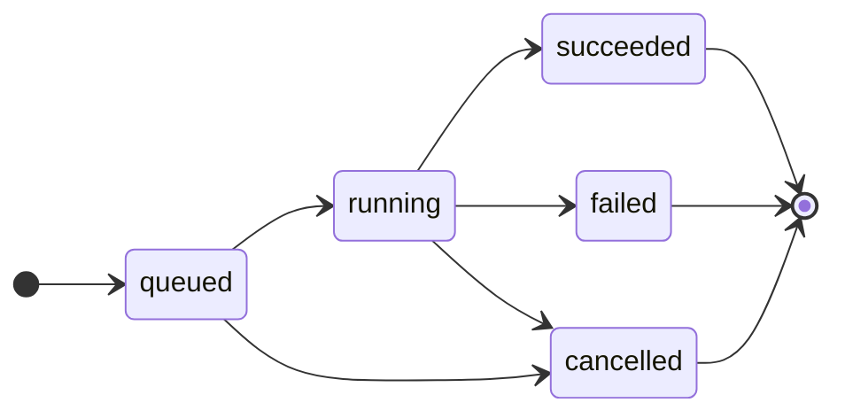
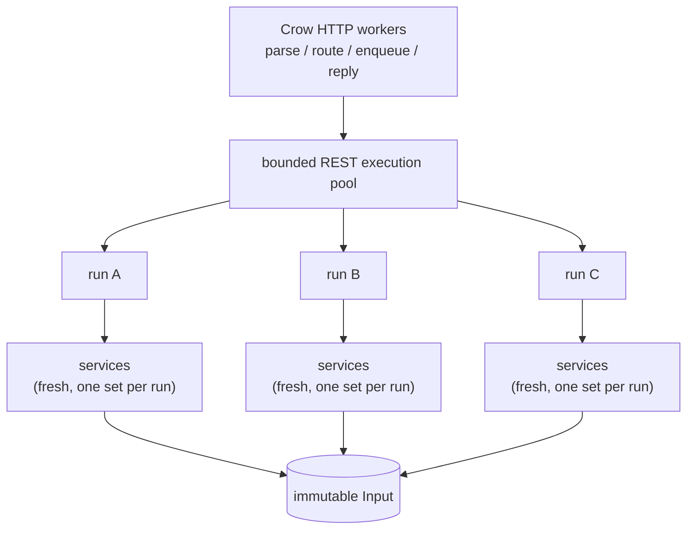

# REST application adapter

`EasyLocal::REST` is an optional Crow-based application adapter. It exposes a
configured EasyLocal `app` as a generic Crow `Blueprint` while keeping HTTP,
JSON, Crow, and server lifecycle completely outside `EasyLocal::Core`.

The design follows the same rule used by the TextUI:

> one run owns freshly bound, mutable EasyLocal services; only the immutable
> Input may be shared across runs.

This keeps concurrency at the application boundary instead of making the bound
app, SolutionManager, neighborhoods, algorithms, or Runner state internally
synchronized.

## Enabling the component

REST is disabled by default:

```sh
cmake -S . -B build/rest \
  -DEASYLOCAL_ENABLE_REST=ON
```

EasyLocal first looks for Crow 1.3 through `find_package`. If it is unavailable,
a pinned Crow `v1.3.3` plus standalone Asio `1.38.2` may be fetched only when
`EASYLOCAL_FETCH_DEPENDENCIES=ON` is explicitly enabled.

Installed consumers request the component explicitly:

```cmake
find_package(EasyLocal CONFIG REQUIRED COMPONENTS Core REST)
target_link_libraries(my_server PRIVATE EasyLocal::REST)
```

A consumer requesting only `Core` neither creates `EasyLocal::REST` nor loads
Crow/Asio.

## Generic app Blueprint

The REST adapter intentionally does not own a Crow server. It produces one
Blueprint per EasyLocal application. Multiple applications can therefore be
mounted into the same Crow process under distinct prefixes:

```cpp
auto assignment_api = easylocal::rest::blueprint(
    "/assignment", assignment_app, AssignmentCodec{});
auto tsp_api = easylocal::rest::blueprint(
    "/tsp", tsp_app, TspCodec{});

crow::SimpleApp server;
server.register_blueprint(assignment_api.crow_blueprint());
server.register_blueprint(tsp_api.crow_blueprint());

server.port(8080)
      .multithreaded()
      .run();
```

Port, middleware, HTTP concurrency, logging, and process lifecycle remain normal
Crow concerns.

A codec supplies the problem-specific JSON boundary:

```cpp
struct Codec
{
    Input decode_input(const crow::json::rvalue& value) const;

    crow::json::wvalue encode_solution(const Input& input, const Solution& solution) const;

    crow::json::wvalue encode_cost(const Cost& cost) const;

    // Optional. Called only when the request contains initial_solution.
    Solution decode_initial_solution(const Input& input, const crow::json::rvalue& value) const;

    // Optional. Called only when the request contains target; without it a
    // target is a JSON number, for arithmetic costs only.
    Cost decode_cost(const crow::json::rvalue& value) const;
};
```

The framework owns only the request envelope. `input` and `initial_solution` are
otherwise opaque JSON values passed unchanged to the codec. A codec may therefore
accept a structured JSON object/array, a JSON string containing an existing text
file representation, or any other JSON representation appropriate to the
problem. If `initial_solution` is omitted, the SolutionManager
`initial_solution()` capability is used when available.

The generic Blueprint is mounted explicitly:

```cpp
auto api = easylocal::rest::blueprint(
    "/assignment",
    application,
    AssignmentCodec{},
    {
        .workers = 4,
        .queue_capacity = 32,
        .completed_run_capacity = 64,
    });

crow::SimpleApp server;
server.register_blueprint(api.crow_blueprint());
```

`app_blueprint` is deliberately non-copyable/non-movable because its Crow route
callbacks refer to its state. Keep it alive for at least as long as the Crow
application uses the registered Blueprint. Codec calls are serialized by the
adapter, so a codec need not provide its own synchronization.

The Assignment REST example demonstrates both supported input styles: a structured
object with `demand`/`capacity` and a JSON string containing the existing textual
assignment-instance representation.

## Run creation envelope

For a Blueprint mounted at `/assignment`, run creation is:

```http
POST /assignment/runners/fi/runs
Content-Type: application/json
```

with a generic envelope:

```json
{
  "input": {
    "demand": [4, 4, 2],
    "capacity": [5, 5]
  }
}
```

or, for a codec that accepts the existing text representation:

```json
{
  "input": "3 2 4 3 2 5 5"
}
```

An application codec may additionally support:

```json
{
  "input": { "...": "..." },
  "initial_solution": { "...": "..." }
}
```

The envelope may also carry a `seed`, a non-negative integer. Stochastic
runners receive an RNG seeded with it; deterministic runners ignore it. Without
an explicit seed a run uses `blueprint_options::seed + <run id>`, so runs differ
but stay reproducible. Status responses report the seed used.

```json
{
  "input": { "...": "..." },
  "seed": 12345
}
```

A `target` cost stops the run as soon as its best cost is at least as good as
the target, a lower bound for example (`stop_at` in C++; every runner honours
it). A JSON string is a cost in the syntax of the command line and the
TextUI: a number, `"[hard, soft]"`, or the problem's own notation when it
provides `read_cost` ([Costs as text](reference/cost.md#costs-as-text)). Otherwise, for
an arithmetic cost the target is a JSON number, an integer for integral costs;
for other costs the codec decodes it with `decode_cost`, and without one a
request with a target is rejected with `422`. Run resources repeat the target,
encoded by `encode_cost`.

```json
{
  "input": { "...": "..." },
  "target": 426
}
```

A `timeout`, in seconds (a non-negative JSON number), stops the run once it has
passed (`timeout` in C++), and `max_evaluations`, a non-negative integer, once
it has made that many evaluations (`max_evaluations` in C++; a runner's own,
if smaller, still applies); run resources repeat them. Any other value is
rejected with `422`.

```json
{
  "input": { "...": "..." },
  "timeout": 2.5,
  "max_evaluations": 100000
}
```

A run may change the app's `parameters`, for itself only: the same paths as
the command line and the TextUI (`runners.<name>.*`, `cost.*`,
`neighborhood.*`), listed by `GET /parameters`. Nested objects and dotted keys
are equivalent, and may be mixed:

```json
{
  "input": { "...": "..." },
  "parameters": {
    "runners": { "sa": { "temperature": { "cooling_rate": 0.9 } } },
    "cost.weights": [1, 20]
  }
}
```

Values are JSON numbers, booleans, strings or arrays of them; a string is
read as the parameter's text, so the values that `GET /parameters` lists can be
sent back as they are. They are applied all or none before the run's initial
solution is built: an unknown path or an invalid value rejects the request
with `422` and the code `invalid_parameters`, whose message names each path.
Run resources repeat the parameters they were submitted with, by path and as
text (`"parameters": {"runners.sa.temperature.cooling_rate": "0.9"}`), so that
a run can be repeated together with its `seed`.

A successful submission returns `202 Accepted`, sets `Location` to the run
resource, and uses `id` consistently:

```json
{
  "id": "42",
  "runner": "fi",
  "seed": 42,
  "status": "queued",
  "cancellation_requested": false,
  "progress": {
    "evaluations": 0,
    "iterations": 0
  }
}
```

## Routes and lifecycle

The generic surface under a chosen prefix is:

| Method | Route | Meaning |
| --- | --- | --- |
| `GET` | `/assignment/` | application/executor metadata |
| `GET` | `/assignment/runners` | registered runner names |
| `GET` | `/assignment/parameters` | the app's parameters: `path`, `description`, `value` (as text), `read_only` |
| `POST` | `/assignment/runners/<runner>/runs` | enqueue a run |
| `GET` | `/assignment/runs/<id>` | inspect status/progress |
| `GET` | `/assignment/runs/<id>/solution` | retrieve terminal solution and cost |
| `POST` | `/assignment/runs/<id>/cancel` | request cooperative cancellation |
| `DELETE` | `/assignment/runs/<id>` | forget a terminal run |

Runs move through:



Cancellation and deletion deliberately have different semantics. `POST
/runs/<id>/cancel` requests cooperative stop and returns `202`; the resource
remains queryable so the client can observe `cancelled` and retrieve a partial
solution. A queued run is `cancelled` at once, without a solution, and leaves
its place in the queue. `DELETE /runs/<id>` is permitted only after the run is
terminal and returns `204 No Content`. Deleting an active run returns `409`.

Every runner is cancellable: the control is carried by the framework-owned
`search_run`, so no per-runner capability is advertised.

## Status and result shape

`GET /runs/<id>` has a stable generic shape:

```json
{
  "id": "42",
  "runner": "fi",
  "seed": 42,
  "status": "running",
  "cancellation_requested": false,
  "progress": {
    "evaluations": 237,
    "iterations": 14,
    "evaluation_limit": 2000
  }
}
```

`evaluation_limit` is omitted when the Runner does not report one. Once the run
has succeeded, or was cancelled with a partial solution, the status also gives
`"solution_url"`, the address of `GET /runs/<id>/solution`; a failed run gives
`"error": {"code": "run_failed", "message": ...}` instead. The `solution` and
`cost` values remain problem-specific and are produced by the codec:

```json
{
  "id": "42",
  "runner": "fi",
  "status": "succeeded",
  "solution": { "...": "..." },
  "cost": { "...": "..." }
}
```

A cooperatively cancelled run may expose the same result shape with
`"status": "cancelled"`; the solution is then the valid partial solution
returned by the controlled Runner.

## Error mapping

Protocol errors use one envelope:

```json
{
  "error": {
    "code": "unknown_runner",
    "message": "runner 'missing' is not registered"
  }
}
```

The generic mapping is:

| HTTP | Meaning |
| --- | --- |
| `400` | syntactically invalid JSON, or arrays and objects nested deeper than 64 levels (`invalid_json`) |
| `404` | unknown runner or run (`unknown_runner`, `run_not_found`) |
| `409` | valid operation in the wrong run state/capability (`result_not_ready`, `run_not_terminal`, `run_not_active`), or the solution of a run that failed (`run_failed`) |
| `422` | valid JSON but invalid run envelope/domain data (`invalid_run_request`), or parameters that do not apply (`invalid_parameters`) |
| `503` | bounded solver queue full (`queue_full`) |
| `500` | unexpected adapter/application failure (`internal_error`) |

Codec/domain validation should throw `std::invalid_argument` for client-supplied
semantic errors; those are mapped to `422`. Other unexpected exceptions while
creating a run are treated as internal failures.

## Bounded completed-run retention

The waiting queue and completed-run history are independently bounded.
`blueprint_options::completed_run_capacity` defaults to 64 and must be positive.
Only terminal records participate in history eviction; queued/running runs are
never evicted. Once the bound is exceeded, the oldest terminal record is removed.
Clients may free a terminal record earlier with `DELETE /runs/<id>`.

This retention is intentionally an in-memory convenience for result/status
retrieval, not a persistent history system. Durable audit/history belongs to the
surrounding web/infrastructure layer.

## Concurrency model

Crow concurrency and solver concurrency are intentionally separate:



Crow request threads do not execute a CPU-bound local search to completion.
They decode the request, materialize the immutable Input and initial Solution,
enqueue work, and return the run identifier.

Each accepted job owns a `Session` on the run's Input, created when the run is
submitted, with the initial solution and the run's seed. The worker calls
`session.run("name", with(control))`, which binds fresh services for that run,
and stores the resulting solution and its cost. Mutable SolutionManager, neighborhood,
algorithm, Runner, RNG, and Solution state therefore belongs to that run only.
No mutex is added to those Core objects and no `Clone()` protocol is required.

The default worker count is `max(1, hardware_concurrency() - 1)` and the default
waiting-queue capacity is 64; both are adapter policy and configurable per
Blueprint.

## Cooperative control and TextUI

Core exposes a small std-only control object:

```cpp
std::stop_source stop;
auto observer = [](const easylocal::run_progress& progress) { /* observe */ };
easylocal::run_control control{stop.get_token(), observer};
```

The observer is non-owning and valid only for the controlled run. It is passed
as the trailing run option, `run(solution, ..., easylocal::with(control))`.
Algorithms never see the control directly: `search_run::should_stop()` checks it
and the `search_run` primitives report progress, so every runner honours
cancellation through the same contract. A run without an explicit control uses
an empty `run_control`, whose checks reduce to null tests.

TextUI and REST therefore share the same architectural contract without sharing
a threading subsystem:

```text
Core:     fresh services per run: Session::run, app.run("name", ...)
TextUI:   one background run owned by the frontend
REST:     bounded pool of background runs owned by the adapter
```

## Security boundary

`EasyLocal::REST` is not an Internet edge/security framework. TLS termination,
authentication, authorization, request-rate limiting, reverse-proxy policy,
ingress controls, and deployment hardening belong to the surrounding network
infrastructure.

The adapter still performs ordinary protocol/application validation and relies
on maintained Crow/Asio HTTP parsing. Queue/history bounds are resource-control
semantics, not a substitute for edge security.

No Crow, Asio, HTTP, or JSON type appears in a Core signature. The architecture
test also prevents optional adapters from reaching into `easylocal/detail/*`.

## HTTP integration test

When REST is enabled on a Unix-like host with `curl`, CTest registers
`easylocal.rest-http`. It starts the real Assignment Crow example and exercises the
public surface with HTTP requests: discovery, malformed JSON, semantic `422`
errors, structured and opaque-text input decoding, `Location`/run IDs, status
and nested progress, result retrieval, active-run delete rejection, cooperative
cancel, cancelled partial result, terminal deletion, and bounded retention.

The test carries both `integration` and `rest-http` labels.
`scripts/build-and-test.sh --with-rest` runs it explicitly even in the normal
fast profile; `--integration` additionally enables the remaining integration
tests such as the installed-package consumer.
