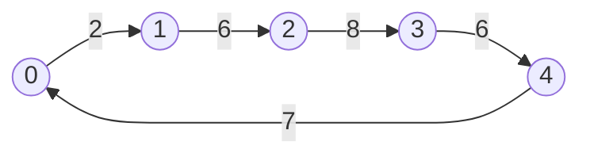
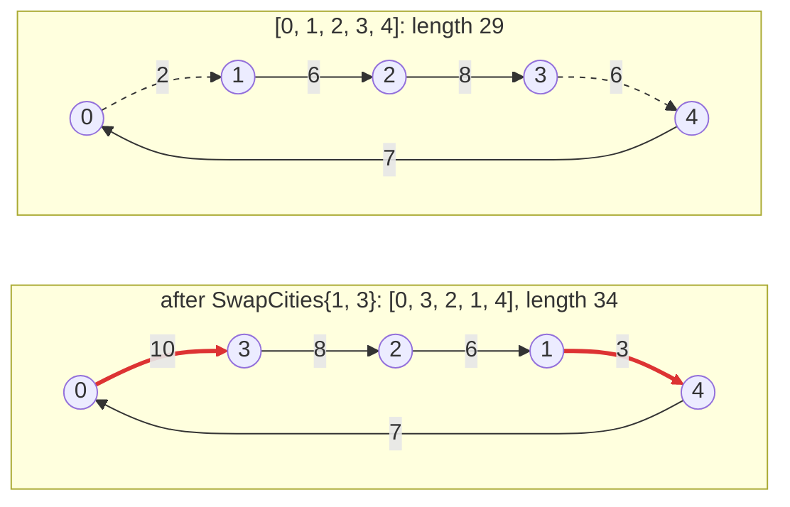

# 1. Modelling the problem

A problem is described by three plain value types and a SolutionManager.

## Representing tours

Before writing code, decide what a solution looks like and how the search
changes it.

**A solution** is a tour, stored as the sequence of the cities in the order
they are visited. `[0, 1, 2, 3, 4]` is the tour 0 → 1 → 2 → 3 → 4 → 0: the
return to the first city is implicit. Its length is 2 + 6 + 8 + 6 + 7 = 29:



Not every sequence is a tour. A tour of n cities is a *permutation* of 0, 1,
..., n − 1: n positions, every city exactly once. `[0, 1, 1, 3, 4]` visits
city 1 twice and city 2 never; `[0, 1, 2]` forgets two cities.

**A move** turns a tour into a nearby one. The first move of the tutorial
(chapter 3 adds a second one) is `SwapCities{i, j}`, which exchanges the cities at positions `i` and `j`. On
`[0, 1, 2, 3, 4]`, `SwapCities{1, 3}` gives `[0, 3, 2, 1, 4]`: the edges 0–1
and 3–4 (dashed) leave the tour, the edges 0–3 and 1–4 (red) enter it, and the
length goes from 29 to 34.



The edges 1–2 and 2–3 stay, traversed in the other direction. In general a
swap replaces the two edges around each of the two positions, four edges in
all; when the positions are next to each other, only two. A swap always turns a
permutation into a permutation, so it never breaks a tour.

## Input, Solution and Move

In code, the three are plain types:

<!-- snippet: tutorial/tsp.hpp:model -->
```cpp
// Input: the instance, immutable during the search.
struct Tsp
{
    // distance[a][b] is the distance between cities a and b (symmetric).
    std::vector<std::vector<double>> distance;

    std::size_t cities() const
    {
        return distance.size();
    }
};

// Solution: order[k] is the k-th city visited; after the last city the tour
// returns to order[0].
struct Tour
{
    std::vector<std::size_t> order;
};

// Move: exchange the cities visited at positions i and j, with i < j.
struct SwapCities
{
    std::size_t i;
    std::size_t j;
};
```

- The **Input** is built once, for example by your parser, and treated as
  immutable while services are bound to it. The distance matrix is a vector of
  rows: the distance between `a` and `b` is `distance[a][b]`.
- A **Solution** does not own or reference the Input.
- A **Move** does not own or reference a Solution: the NeighborhoodExplorer
  applies it to one (chapter 3).

None of them derives from a framework class or needs any operator: plain
structs are enough.

## The SolutionManager

The SolutionManager owns *solution semantics*: which solutions are valid and how
to build one.

<!-- snippet: tutorial/tsp.hpp:solution-manager!random-solution -->
```cpp
class TourManager : public easylocal::solution_manager_base<Tsp, Tour>
{
public:
    // The constructor of the base: from the Input, which input() gives back.
    using solution_manager_base::solution_manager_base;

    // The cities in index order: 0, 1, ..., n - 1.
    Tour initial_solution() const
    {
        Tour tour{std::vector<std::size_t>(input().cities())};
        std::ranges::iota(tour.order, std::size_t{0});
        return tour;
    }

    // A tour is valid when it is a permutation of 0, 1, ..., n - 1: it has
    // n positions and visits every city exactly once.
    bool is_valid(const Tour& tour) const
    {
        return std::ranges::is_permutation(
            tour.order,
            std::views::iota(std::size_t{0}, input().cities()));
    }
};
```

- `easylocal::solution_manager_base<Input, Solution>` provides the `input_type`
  and `solution_type` aliases, the constructor and `input()`, the bound
  Input. It is optional and non-virtual; a hand-written class with
  the same members works as well.
- `is_valid` is required and checks *structural* validity: the representation is
  well formed. Here it checks the permutation property:
  `std::ranges::is_permutation` compares `tour.order` with the sequence 0, 1,
  ..., n − 1, produced by `std::views::iota` without storing it, and is true
  only when the two have the same length and the same elements. It takes
  quadratic time at worst; for long tours, a `std::vector<bool>` that marks
  the cities already seen does the same check in linear time.
- A solution that violates problem constraints is still valid: such
  violations are expressed as cost (chapter 2).
- `initial_solution()` is optional. Write it when something needs to build
  solutions: here you, through the bound runner's `initial_solution()`
  (chapter 5); later a solver or the interactive tester. Chapter 8 adds a second way to
  build one, at random.

> **Essential and advanced.** These types and this SolutionManager are the
> essential version: what a local search needs to run. Some *advanced
> components*, the tools of the later chapters, need a few more features, each
> added in the chapter that introduces it: solvers that start from random
> solutions need `random_solution` (chapter 8), reading tours from files and
> printing them need I/O hooks (chapter 5), and the neighborhood checks
> compare them with `==` (chapter 14). Until you use one of them, you need not write
> anything for it. When you do, a missing feature is a compile error that names
> it, or, in the interactive tester, a command that is not offered.

The SolutionManager never computes the cost: the cost always comes from cost
components, the subject of the next chapter.

## See also

- [Problem model](../reference/problem-model.md): optional I/O and display
  hooks for Input, Solution and Move.
- [SolutionManager](../reference/solution-manager.md): the full contract.

## Next steps

[Chapter 2](02-cost.md) gives the tour a cost.
