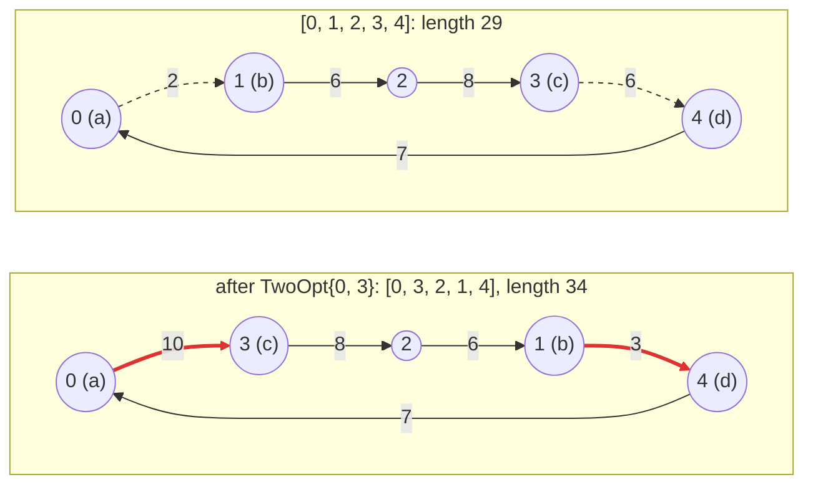

# 3. Moves

The **NeighborhoodExplorer** owns *move semantics*: which moves exist, whether a
move is valid and how it changes a solution.

## Only what your algorithms use

An explorer has two required members, `is_valid(solution, move)` and
`make_move(solution, move)`. Everything else is optional, and you write it only
if an algorithm or a tool you use needs it:

| Member | Needed by |
| --- | --- |
| `is_valid`, `make_move` | every algorithm |
| `moves(solution)`, or the cursor `first_move` / `next_move` | algorithms that scan the neighborhood: First Improvement, Best Improvement |
| `random_move(solution, rng)` | algorithms that sample it: Simulated Annealing |
| `name()` | the interactive tester (chapter 12) |

So an explorer used only by Simulated Annealing needs `random_move` and no
enumeration at all, and the quick start, which runs only First Improvement,
has no `random_move`. Use an explorer with an algorithm that needs a member it
lacks, and the program does not compile: the error names the missing
requirement.

This is a change from EasyLocal 3, where a NeighborhoodExplorer derived from a
base class with pure virtual functions and had to implement all of them,
`FirstMove`, `NextMove` and `RandomMove` included, even when no algorithm in
the program called some of them. Here the requirements come from the
algorithms you actually compose, and are checked at compile time.

The explorers of this tutorial implement both enumeration and sampling,
because chapter 5 runs them with First Improvement and with Simulated
Annealing.

## Swap moves

The *neighborhood* of a tour is the set of moves that can be applied to it.
For `SwapCities` it has one move for every pair of positions `i < j`:
n(n − 1)/2 moves, 10 for five cities.

<!-- snippet: tutorial/tsp.hpp:neighborhood -->
```cpp
class SwapExplorer : public easylocal::neighborhood_explorer_base<TourManager, SwapCities>
{
public:
    using neighborhood_explorer_base::neighborhood_explorer_base;

    // Every pair of positions i < j, one move at a time.
    easylocal::generator<SwapCities> moves(const Tour& tour) const
    {
        const auto n = tour.order.size();
        for (std::size_t i = 0; i < n; ++i)
            for (std::size_t j = i + 1; j < n; ++j)
                co_yield SwapCities{i, j};
    }

    // Uniform: two distinct positions, each pair equally likely, put in order.
    template<std::uniform_random_bit_generator RNG>
    std::optional<SwapCities> random_move(const Tour& tour, RNG& rng) const
    {
        const auto n = tour.order.size();
        if (n < 2)
            return std::nullopt;
        std::uniform_int_distribution<std::size_t> pick{0, n - 1};
        const auto i = pick(rng);
        auto j = pick(rng);
        while (j == i)
            j = pick(rng);
        return SwapCities{std::min(i, j), std::max(i, j)};
    }

    bool is_valid(const Tour& tour, const SwapCities& move) const
    {
        return move.i < move.j && move.j < tour.order.size();
    }

    void make_move(Tour& tour, const SwapCities& move) const
    {
        std::swap(tour.order[move.i], tour.order[move.j]);
    }
};
```

- `is_valid(solution, move)` and `make_move(solution, move)` are required.
  `is_valid` checks the move against an already valid solution: two distinct
  positions, in order, inside the tour. `make_move` changes the solution in
  place, here with one `std::swap`.
- `moves(solution)` enumerates the moves for *deterministic* algorithms such
  as First Improvement. Here it is a generator: each `co_yield` hands one move
  to the runner and pauses until the runner asks for the next one. Any input
  range whose elements convert to the move type works as well. Avoid filling a
  container: the whole neighborhood would be built even when the runner stops
  at its first move.
- `random_move(solution, rng)` samples one move for *stochastic* algorithms
  such as Simulated Annealing. It need not be uniform, but should be cheap: it
  runs once per proposal. Here two positions are drawn, the second again until
  it differs from the first, and put in order; every pair has the same
  probability. Listing all the moves to pick one would cost a whole
  neighborhood per proposal.
- A tour with fewer than two cities has no swap moves, so `random_move` may
  have no move to return. Its result is a `std::optional<SwapCities>`, a value
  that either holds a `SwapCities` or is empty: `return SwapCities{...};`
  returns one that holds a move, `return std::nullopt;` (the standard name
  for "no value") an empty one. The caller tests it like a pointer,
  `if (move)`, and reads the move with `*move`.

`easylocal::neighborhood_explorer_base<SolutionManager, Move>` provides the
aliases and the SolutionManager reference; like the SolutionManager base, it is
optional and non-virtual.

Attach the explorer with a recipe, `neighborhood<SwapExplorer>()`. In debug
builds the framework asserts that the solution and the move are valid before
every application, and that the solution is valid afterwards.

## 2-opt moves

`TwoOpt{i, j}` removes two edges of the tour: the one leaving position `i`,
from city `a` to city `b`, and the one leaving position `j`, from `c` to `d`.
It reconnects the tour with the edges a → c and b → d, which means traversing
the part from `b` to `c` backwards: the cities at positions `i + 1` to `j` are
reversed. On `[0, 1, 2, 3, 4]`, `TwoOpt{0, 3}` reverses positions 1 to 3:



The edges a → b and c → d (dashed) leave the tour, a → c and b → d (red) enter
it. The edges in between stay; in a symmetric TSP, traversing them backwards
does not change their length.

<!-- snippet: tutorial/tsp.hpp:two-opt!two-opt-name -->
```cpp
// Move: reverse the part of the tour between positions i + 1 and j.
struct TwoOpt
{
    std::size_t i;
    std::size_t j;
};

class TwoOptExplorer : public easylocal::neighborhood_explorer_base<TourManager, TwoOpt>
{
public:
    using neighborhood_explorer_base::neighborhood_explorer_base;

    // The moves are the pairs i + 2 <= j < n, by i and then by j: with
    // j = i + 1 the segment would be one city, and with i = 0, j = n - 1 the
    // two removed edges would be the same one, so that pair is skipped.
    // A cursor enumerates them in place: first_move writes the first move into
    // `move`, next_move turns `move` into the following one, and both return
    // false when there is none.
    bool first_move(const Tour& tour, TwoOpt& move) const
    {
        move = TwoOpt{0, 1}; // just before the first move, TwoOpt{0, 2}
        return next_move(tour, move);
    }

    bool next_move(const Tour& tour, TwoOpt& move) const
    {
        const auto n = tour.order.size();
        do
        {
            if (++move.j == n) // the last j for this i: on to the next i
            {
                ++move.i;
                move.j = move.i + 2;
            }
            if (move.j >= n) // no i left
                return false;
        }
        while (move.i == 0 && move.j + 1 == n);
        return true;
    }

    // Uniform by rejection: two positions drawn independently, ordered, and
    // drawn again while they are not a 2-opt move.
    template<std::uniform_random_bit_generator RNG>
    std::optional<TwoOpt> random_move(const Tour& tour, RNG& rng) const
    {
        const auto n = tour.order.size();
        if (n < 4)
            return std::nullopt;
        std::uniform_int_distribution<std::size_t> pick{0, n - 1};
        while (true)
        {
            auto i = pick(rng);
            auto j = pick(rng);
            if (j < i)
                std::swap(i, j);
            if (i + 2 <= j && !(i == 0 && j + 1 == n))
                return TwoOpt{i, j};
        }
    }

    bool is_valid(const Tour& tour, const TwoOpt& move) const
    {
        return move.i + 2 <= move.j && move.j < tour.order.size();
    }

    // The segment is the j - i cities from position i + 1: a span views it in
    // place, and reversing the view reverses those cities in the tour.
    void make_move(Tour& tour, const TwoOpt& move) const
    {
        std::ranges::reverse(std::span{tour.order}.subspan(move.i + 1, move.j - move.i));
    }
};
```

- The moves are the pairs with `i + 2 <= j`: with `j = i + 1` the reversed
  segment would be a single city. The pair `i = 0`, `j = n − 1` is skipped
  too: its two edges are the same edge, the one that closes the tour.
- This explorer enumerates its moves with a **cursor** instead of a generator:
  `first_move(tour, move)` writes the first move into `move`, and
  `next_move(tour, move)` turns `move` into the one that follows it; both
  return `false` when there is no such move. The runner calls `first_move`
  once and then `next_move` until it stops or gets `false`. `first_move`
  starts from `TwoOpt{0, 1}`, just before the first move, and lets
  `next_move` find it.
- `make_move` reverses the segment in place. `std::span{tour.order}` is a view
  of the vector, and `subspan(offset, count)` narrows it to the `j − i`
  cities from position `i + 1`; `std::ranges::reverse` then reverses them in
  the vector itself.
- `random_move` draws two positions and draws again until they form a 2-opt
  move: uniform over the moves, and constant expected time, since most draws
  are valid.

### Generator or cursor

The two explorers enumerate their moves in the two ways EasyLocal accepts:

| | `SwapExplorer`: generator | `TwoOptExplorer`: cursor |
| --- | --- | --- |
| members | `moves(solution)` | `first_move(solution, move)`, `next_move(solution, move)` |
| where the position is kept | in the paused generator | in the move itself |
| how it reads | nested loops, as if listing every move | a step from one move to the next |

Both are lazy: a move is produced only when the runner asks for it, so First
Improvement, which stops at the first improving move, never produces the rest.
A generator is usually easier to write; a cursor needs no coroutine, and is the
style of EasyLocal 3 explorers. When an explorer has both, the cursor is used.
Algorithms do not see the difference: First Improvement and the other runners
accept either explorer, and chapter 6 combines the two in one neighborhood.

## See also

- [NeighborhoodExplorer](../reference/neighborhood-explorer.md): the full
  contract, cursors and unions.

## Next steps

Evaluating a move currently means applying it to a copy and re-evaluating the
whole tour. [Chapter 4](04-delta-evaluation.md) computes the effect of a 2-opt
move on the length directly.
