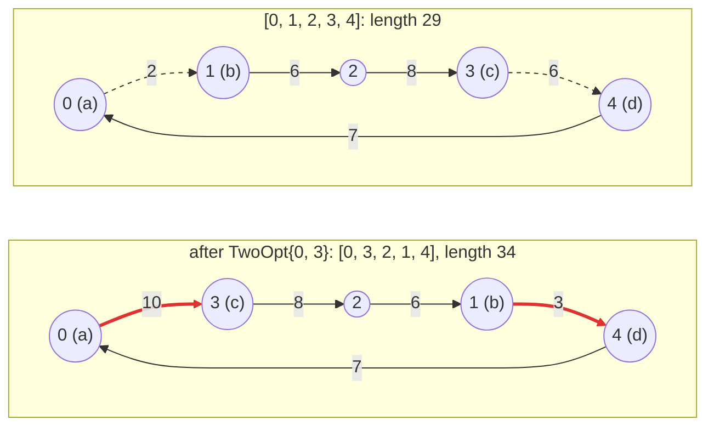

# 3. Moves

The **NeighborhoodExplorer** defines the moves available from a solution,
checks their validity and applies them. Keeping this logic in one component
lets different algorithms search the same neighborhood.

## Only what your algorithms use

Every explorer needs `is_valid(solution, move)` and
`make_move(solution, move)`. The optional `neighborhood_explorer_base` supplies
its type aliases and Input access from the SolutionManager. Add other members
as your algorithms and tools need them:

| Member | Needed by |
| --- | --- |
| `input_type`, `solution_type`, `move_type`, `input()` | every algorithm (from `neighborhood_explorer_base`) |
| `is_valid`, `make_move` | every algorithm |
| `moves(solution)`, or the cursor `first_move` / `next_move` | algorithms that scan the neighborhood: First Improvement, Best Improvement, Tabu Search |
| `random_move(solution, rng)` | algorithms that sample it: Simulated Annealing, Hill Climbing, Late Acceptance Hill Climbing, Great Deluge, Pareto Late Acceptance Hill Climbing |
| `inverse(solution, move, tabu_move)` | Tabu Search: whether a move is forbidden by one applied earlier |
| `name()` | the interactive tester (chapter 13) |

For example, Simulated Annealing needs random sampling but no enumeration.
The quick start uses only First Improvement, so its explorer has no
`random_move`. If an algorithm needs a missing member, the compiler names it.

Unlike EasyLocal 3's virtual interface, this lets you implement just the
operations your program uses.

The explorers of this tutorial implement both enumeration and sampling,
because chapter 5 runs them with First Improvement and with Simulated
Annealing.

## Swap moves

The *neighborhood* of a tour is the set of moves that can be applied to it.
For `SwapCities` it has one move for every pair of positions `i < j`:
n(n − 1)/2 moves, 10 for five cities.

<!-- snippet: tutorial/tsp.hpp:neighborhood -->
```cpp
class SwapExplorer : public easylocal::neighborhood_explorer_base<TourManager, SwapCities>
{
public:
    // The constructor of the base: from the SolutionManager, whose Input the
    // explorer reaches with input().
    using neighborhood_explorer_base::neighborhood_explorer_base;

    // Every pair of positions i < j, one move at a time.
    easylocal::generator<SwapCities> moves(const Tour& tour) const
    {
        const auto n = tour.order.size();
        for (std::size_t i = 0; i < n; ++i)
            for (std::size_t j = i + 1; j < n; ++j)
                co_yield SwapCities{i, j};
    }

    // Uniform: two distinct positions, each pair equally likely, put in order.
    template<std::uniform_random_bit_generator RNG>
    std::optional<SwapCities> random_move(const Tour& tour, RNG& rng) const
    {
        const auto n = tour.order.size();
        if (n < 2)
            return std::nullopt;
        std::uniform_int_distribution<std::size_t> pick{0, n - 1};
        const auto i = pick(rng);
        auto j = pick(rng);
        while (j == i)
            j = pick(rng);
        return SwapCities{std::min(i, j), std::max(i, j)};
    }

    bool is_valid(const Tour& tour, const SwapCities& move) const
    {
        return move.i < move.j && move.j < tour.order.size();
    }

    void make_move(Tour& tour, const SwapCities& move) const
    {
        std::swap(tour.order[move.i], tour.order[move.j]);
    }
};
```

- `is_valid` checks that the positions are distinct, ordered and within an
  already valid tour. `make_move` applies the move in place with `std::swap`.
- `moves(solution)` enumerates moves for algorithms such as First Improvement.
  Each `co_yield` returns one move and pauses until the runner requests another.
  This avoids building a whole container when the search may stop after the
  first improvement. Other input ranges also work if their elements convert
  to the move type.
- `random_move(solution, rng)` samples a move for algorithms such as Simulated
  Annealing. Here it draws two distinct positions and orders them, giving
  every pair equal probability. Uniform sampling is optional, but sampling
  should be cheap: avoid enumerating the neighborhood for each proposal.
- A tour with fewer than two cities has no swap moves. The return type,
  `std::optional<SwapCities>`, can hold either a move or no value. Return
  `SwapCities{...}` on success and `std::nullopt` for an empty neighborhood.
  The caller checks `if (move)` and reads the value with `*move`.

`easylocal::neighborhood_explorer_base<SolutionManager, Move>` provides the
aliases and the SolutionManager reference; like the SolutionManager base, it is
optional and non-virtual.

Attach the explorer with a recipe, `neighborhood<SwapExplorer>()`. In debug
builds the framework asserts that the solution and the move are valid before
every application, and that the solution is valid afterwards.

## 2-opt moves

`TwoOpt{i, j}` removes two edges of the tour: the one leaving position `i`,
from city `a` to city `b`, and the one leaving position `j`, from `c` to `d`.
It reconnects the tour with the edges a → c and b → d, which means traversing
the part from `b` to `c` backwards: the cities at positions `i + 1` to `j` are
reversed. On `[0, 1, 2, 3, 4]`, `TwoOpt{0, 3}` reverses positions 1 to 3:



The edges a → b and c → d (dashed) leave the tour, a → c and b → d (red) enter
it. The edges in between stay; in a symmetric TSP, traversing them backwards
does not change their length.

<!-- snippet: tutorial/tsp.hpp:two-opt!two-opt-name -->
```cpp
// Move: reverse the part of the tour between positions i + 1 and j.
struct TwoOpt
{
    std::size_t i;
    std::size_t j;
};

class TwoOptExplorer : public easylocal::neighborhood_explorer_base<TourManager, TwoOpt>
{
public:
    // The constructor of the base: from the SolutionManager, whose Input the
    // explorer reaches with input().
    using neighborhood_explorer_base::neighborhood_explorer_base;

    // The moves are the pairs i + 2 <= j < n, by i and then by j: with
    // j = i + 1 the segment would be one city, and with i = 0, j = n - 1 the
    // two removed edges would be the same one, so that pair is skipped.
    // A cursor enumerates them in place: first_move writes the first move into
    // `move`, next_move turns `move` into the following one, and both return
    // false when there is none.
    bool first_move(const Tour& tour, TwoOpt& move) const
    {
        move = TwoOpt{0, 1}; // just before the first move, TwoOpt{0, 2}
        return next_move(tour, move);
    }

    bool next_move(const Tour& tour, TwoOpt& move) const
    {
        const auto n = tour.order.size();
        do
        {
            if (++move.j == n) // the last j for this i: on to the next i
            {
                ++move.i;
                move.j = move.i + 2;
            }
            if (move.j >= n) // no i left
                return false;
        }
        while (move.i == 0 && move.j + 1 == n);
        return true;
    }

    // Uniform by rejection: two positions drawn independently, ordered, and
    // drawn again while they are not a 2-opt move.
    template<std::uniform_random_bit_generator RNG>
    std::optional<TwoOpt> random_move(const Tour& tour, RNG& rng) const
    {
        const auto n = tour.order.size();
        if (n < 4)
            return std::nullopt;
        std::uniform_int_distribution<std::size_t> pick{0, n - 1};
        while (true)
        {
            auto i = pick(rng);
            auto j = pick(rng);
            if (j < i)
                std::swap(i, j);
            if (i + 2 <= j && !(i == 0 && j + 1 == n))
                return TwoOpt{i, j};
        }
    }

    // The moves the cursor lists: (0, n - 1) would only reverse the tour,
    // preserving the same edges in the symmetric TSP.
    bool is_valid(const Tour& tour, const TwoOpt& move) const
    {
        const auto n = tour.order.size();
        return move.i + 2 <= move.j && move.j < n && !(move.i == 0 && move.j + 1 == n);
    }

    // The segment is the j - i cities from position i + 1: a span views it in
    // place, and reversing the view reverses those cities in the tour.
    void make_move(Tour& tour, const TwoOpt& move) const
    {
        std::ranges::reverse(std::span{tour.order}.subspan(move.i + 1, move.j - move.i));
    }
};
```

- The moves are the pairs with `i + 2 <= j`: with `j = i + 1` the reversed
  segment would be a single city. The pair `i = 0`, `j = n − 1` is skipped
  too: the two edges meet at the first city, and reversing the remaining
  cities would only traverse the same symmetric tour in the opposite direction.
- This explorer uses a **cursor**. `first_move(tour, move)` fills in the first
  move; `next_move(tour, move)` advances to the next. Both return `false` when
  no move is available. Here `first_move` starts from `TwoOpt{0, 1}`, just
  before the first valid move, and delegates the advance to `next_move`.
- `make_move` reverses the segment in place. `std::span{tour.order}` is a view
  of the vector, and `subspan(offset, count)` narrows it to the `j − i`
  cities from position `i + 1`; `std::ranges::reverse` then reverses them in
  the vector itself.
- `random_move` draws two positions and draws again until they form a 2-opt
  move: uniform over the moves, and constant expected time, since most draws
  are valid.

### Generator or cursor

The two explorers enumerate their moves in the two ways EasyLocal accepts:

| | `SwapExplorer`: generator | `TwoOptExplorer`: cursor |
| --- | --- | --- |
| members | `moves(solution)` | `first_move(solution, move)`, `next_move(solution, move)` |
| where the position is kept | in the paused generator | in the move itself |
| how it reads | nested loops, as if listing every move | a step from one move to the next |

Both produce moves only as needed, so First Improvement stops enumeration
when it finds an improvement. A generator is usually easier to write; a cursor
needs no coroutine and matches the structure of EasyLocal 3 explorers. If an
explorer provides both, the library uses the cursor.

The choice does not affect how you compose the search. Runners accept either
form, and chapter 6 combines these explorers in one neighborhood.

## See also

- [NeighborhoodExplorer](../reference/neighborhood-explorer.md): the full
  contract, cursors and unions.

## Next steps

Evaluating a move currently means applying it to a copy and re-evaluating the
whole tour. [Chapter 4](04-delta-evaluation.md) computes the effect of a 2-opt
move on the length directly.
