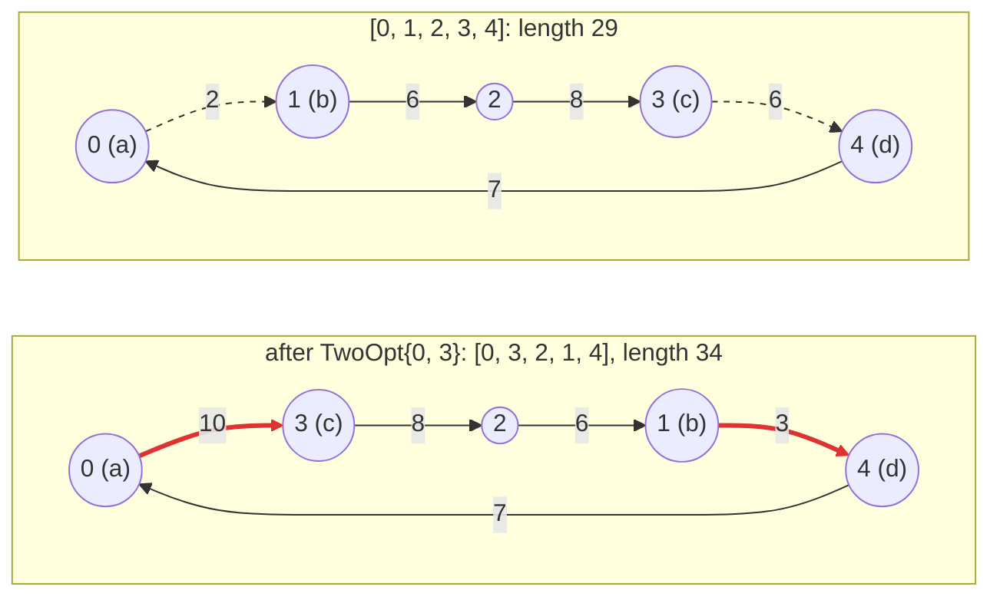

# 4. Delta evaluation

To evaluate a swap move, EasyLocal applies it to a copy of the tour and
evaluates `TourLength` on the copy: a pass over the whole tour for every move.
A move changes only a few edges, though, and its effect on the length could be
computed from those edges alone. A **delta evaluator** does that.

For swap moves, such a delta is possible but fiddly: the edges around the two
positions overlap when the positions are adjacent or one apart, also across the
end of the tour, and each case needs its own formula. This chapter introduces a
move that always changes exactly two edges, *2-opt*, and gives it a delta
evaluator; the swap moves stay without one.

## A second move: 2-opt

`TwoOpt{i, j}` removes two edges of the tour: the one leaving position `i`,
from city `a` to city `b`, and the one leaving position `j`, from `c` to `d`.
It reconnects the tour with the edges a → c and b → d, which means traversing
the part from `b` to `c` backwards: the cities at positions `i + 1` to `j` are
reversed. On `[0, 1, 2, 3, 4]`, `TwoOpt{0, 3}` reverses positions 1 to 3:



The edges a → b and c → d (dashed) leave the tour, a → c and b → d (red) enter
it. The edges in between stay; in a symmetric TSP, traversing them backwards
does not change their length.

<!-- snippet: tutorial/tsp.hpp:two-opt!two-opt-name -->
```cpp
// Move: reverse the part of the tour between positions i + 1 and j.
struct TwoOpt
{
    std::size_t i;
    std::size_t j;
};

class TwoOptExplorer : public easylocal::neighborhood_explorer_base<TourManager, TwoOpt>
{
public:
    using neighborhood_explorer_base::neighborhood_explorer_base;

    // Pairs i + 2 <= j: shorter segments would change nothing. With i = 0 and
    // j = n - 1 the two removed edges are the same one, so that pair is skipped.
    easylocal::generator<TwoOpt> moves(const Tour& tour) const
    {
        const auto n = tour.order.size();
        for (std::size_t i = 0; i + 2 < n; ++i)
            for (std::size_t j = i + 2; j < n && !(i == 0 && j + 1 == n); ++j)
                co_yield TwoOpt{i, j};
    }

    // Uniform by rejection: two positions drawn independently, ordered, and
    // drawn again while they are not a 2-opt move.
    template<std::uniform_random_bit_generator RNG>
    std::optional<TwoOpt> random_move(const Tour& tour, RNG& rng) const
    {
        const auto n = tour.order.size();
        if (n < 4)
            return std::nullopt;
        std::uniform_int_distribution<std::size_t> pick{0, n - 1};
        while (true)
        {
            auto i = pick(rng);
            auto j = pick(rng);
            if (j < i)
                std::swap(i, j);
            if (i + 2 <= j && !(i == 0 && j + 1 == n))
                return TwoOpt{i, j};
        }
    }

    bool is_valid(const Tour& tour, const TwoOpt& move) const
    {
        return move.i + 2 <= move.j && move.j < tour.order.size();
    }

    // The segment is the j - i cities from position i + 1: a span views it in
    // place, and reversing the view reverses those cities in the tour.
    void make_move(Tour& tour, const TwoOpt& move) const
    {
        std::ranges::reverse(std::span{tour.order}.subspan(move.i + 1, move.j - move.i));
    }
};
```

- `moves` enumerates the pairs with `i + 2 <= j`: with `j = i + 1` the
  reversed segment would be a single city. The pair `i = 0`, `j = n − 1` is
  skipped too: its two edges are the same edge, the one that closes the tour.
- `make_move` reverses the segment in place. `std::span{tour.order}` is a view
  of the vector, and `subspan(offset, count)` narrows it to the `j − i`
  cities from position `i + 1`; `std::ranges::reverse` then reverses them in
  the vector itself.
- `random_move` draws two positions and draws again until they form a 2-opt
  move: uniform over the moves, and constant expected time, since most draws
  are valid.

## The delta evaluator

The change of the tour length under a 2-opt move needs only the four cities
`a`, `b`, `c` and `d`:

<!-- snippet: tutorial/tsp.hpp:delta -->
```cpp
class TwoOptLengthDelta
{
public:
    explicit TwoOptLengthDelta(const Tsp& input) : input_{input} {}

    // The tour goes a -> b ... c -> d; after the move it goes a -> c ... b -> d.
    double delta_evaluate(const Tour& tour, const TwoOpt& move) const
    {
        const auto n = tour.order.size();
        const auto a = tour.order[move.i];
        const auto b = tour.order[move.i + 1];
        const auto c = tour.order[move.j];
        const auto d = tour.order[(move.j + 1) % n];
        const auto& distance = input_.distance;
        return distance[a][c] + distance[b][d] - distance[a][b] - distance[c][d];
    }

private:
    const Tsp& input_;
};
```

It is bound to the component in the neighborhood recipe:

<!-- snippet: tutorial/main.cpp:nhe-recipe -->
```cpp
auto nhe =
    el::neighborhood<TwoOptExplorer>() | el::delta<TourLength, TwoOptLengthDelta>();
```

- The contract is algebraic: `Value + Delta -> Value`. With an arithmetic value
  the delta can have the same type; with a domain value, define
  `operator+(Value, Delta)`.
- Deltas are **per component and per neighborhood**. The cost of a move is
  always recomputed by the cost expression from the updated component values,
  so a delta never deals with weights or hierarchical structure.
- Coverage can be partial: components without a delta for a neighborhood are
  re-evaluated on a candidate solution. When every component has one, no
  candidate solution is built.

> **When not to write a delta.** A delta pays off when it looks at the part of
> the solution the move touches. If computing it means looking at the whole
> solution, for instance recounting the load of every machine to know the load
> of two, it costs as much as a full evaluation: leave the component without a
> delta and let EasyLocal evaluate it on the candidate solution, with no code
> to write and check. The Assignment and Exam Timetabling examples do so.

> **Choice: separate or co-located.** A delta evaluator can be a separate class,
> as here, or a `delta_evaluate(solution, move)` member of the component itself,
> attached with `delta<TourLength>()`. Separate evaluators keep a component
> reusable across neighborhoods; co-located ones are shorter when a component
> serves a single neighborhood.

Chapter 10 shows how to check that a delta agrees with the full evaluation.

## See also

- [Cost](../reference/cost.md#delta-evaluators): the delta contract.
- [NeighborhoodExplorer](../reference/neighborhood-explorer.md): how deltas are
  bound.

## Next steps

[Chapter 5](05-running-a-search.md) runs the search.
