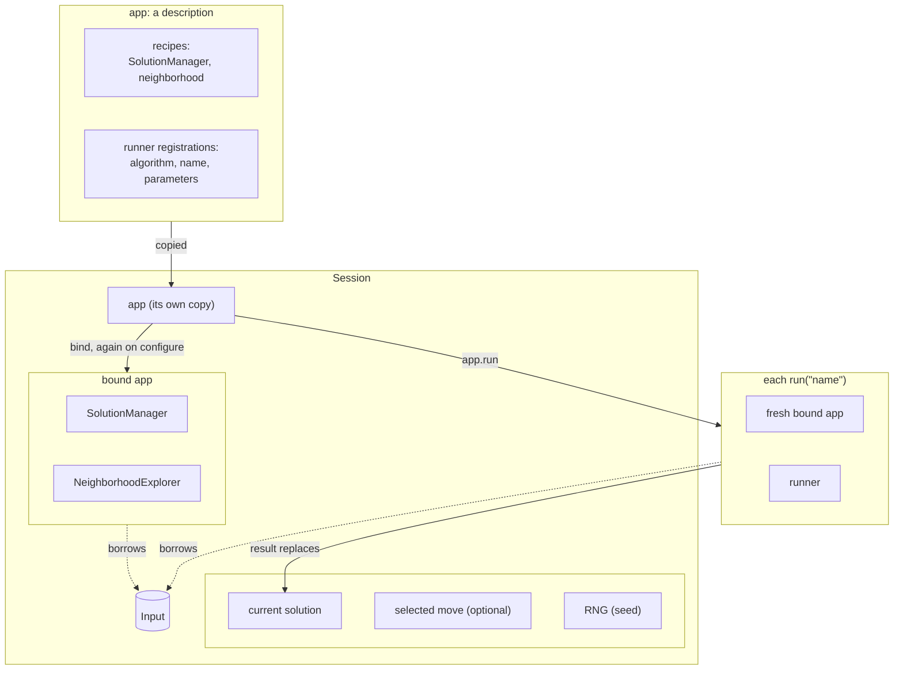

# 11. Applications

An **app** packages the problem recipes and gives each available algorithm a
name. A **Session** uses that app on one Input and keeps a current solution.
Together they let the command line, interactive tester and REST service reuse
the same problem definition and parameter settings.

## The app

<!-- snippet: tutorial/main.cpp:app -->
```cpp
auto application =
    el::app("tsp")
        .with_solution_manager(sm)
        .with_neighborhood(nhe)
        .with_runner<runners::FirstImprovement>("fi")
        .with_runner<runners::SimulatedAnnealing<Classic>>(
            "sa",
            {.temperature = {.samples_per_temperature = 50}});

auto piped_application = el::app("tsp") | sm | nhe
    | el::runner<runners::FirstImprovement>("fi")
    | el::runner<runners::SimulatedAnnealing<Classic>>(
        "sa",
        {.temperature = {.samples_per_temperature = 50}});
```

- The app is a description. Binding it will construct the services.
- Register a runner with its algorithm class, a name and optional parameters.
  The app stores the parameters; change them later through
  `runner_parameters<Algorithm>("name")`.
- Simulated Annealing is registered with its parameters, those of its
  temperature policy as a group: `runners::SimulatedAnnealing<Classic>` takes
  `SimulatedAnnealingParameters<ClassicParameters>`, whose `temperature` is the
  policy's and whose `max_evaluations` bounds the run.
- The two spellings are equivalent: `with_*` calls, or pipes with
  `el::runner<Algorithm>(name, parameters)` for each registration.
- Registration checks compatibility at compile time. For example, First
  Improvement needs an explorer that can enumerate moves, through `moves()`
  or a cursor.
- An app also registers pipelines of stages, `el::pipeline("name", stages...)`,
  run by name like a runner; a stage may be an algorithm on the app's recipes,
  `stage<A>(name, parameters)` (chapter 8).
- `application.bind(tsp)` builds the services once for an Input, a `BoundApp`
  whose `run("fi", solution, rng)` runs a registration on them; the Session
  below does this for you.

## The Session

A Session owns its Input, constructs the services and keeps a *current
solution*. You can inspect and change that solution one move at a time,
or run an algorithm to improve it:

<!-- snippet: tutorial/main.cpp:session -->
```cpp
// The app on one Input, which the session owns, with a seeded RNG.
el::Session session{application, tsp, /* seed */ 2026};
session.use_initial_solution();

// A step by hand: select the first improving move, if any, and apply it.
if (session.use_first_improving_move())
    session.apply_move();

// A registered runner, by name, from the current solution; false means no
// runner has that name.
if (!session.run("sa")) // receives the session's RNG
    return 1;
const double session_cost = session.evaluate();
const Tour session_tour = session.solution(); // a copy: the session goes on
```

- `el::Session{application, tsp, seed}` copies the app and Input, so the
  session can outlive both source variables. Its seed defaults to 0 and
  controls random solutions, moves and run seeds. Repeating the same commands
  with the same seed reproduces the session. Create a new Session for another
  Input.
- `use_initial_solution()` makes the initial tour the current solution
  (`use_random_solution()` makes a random one, with the session's RNG).
- Select a move with `use_first_improving_move()`, then apply it with
  `apply_move()`. Selection returns `false` if no improvement exists. Other
  selectors include `use_first_move`, `use_next_move`, `use_best_move` and
  `use_random_move`. Before applying a move, `evaluate_move()` shows its
  resulting cost.
- `run("sa")` runs the runner registered as `"sa"` from the current solution,
  and makes its result the current solution. It returns `false` when no runner
  has that name.
- `evaluate()` and `solution()` read the current cost and solution.
  `solution()` returns a reference to the session's solution, which the next
  command may replace: copy it to keep it, as here.

Selection functions and `run` are `[[nodiscard]]`. Check their results so a
missing move or misspelt runner name does not silently leave the session
unchanged.

Each `run` builds fresh services from the app, with the runner's current
parameters, so runs share nothing but the immutable Input.

What the app and the Session hold, and what each run builds:



### Parameters and targets

The app gathers its parts' parameters under these paths:

- `runners.<name>.*`: the named algorithm;
- `cost.*`: expression weights and configurable components or functions;
- `solution_manager.*`: the SolutionManager;
- `neighborhood.*`: the explorer or union biases.

Use the Session to update these values and run toward a target cost:

<!-- snippet: tutorial/main.cpp:session-parameters -->
```cpp
// The app's parameters by path; they change this session's app only.
const std::array changes{
    el::config::text_override{"runners.sa.temperature.cooling_rate", "0.9"}};
if (!session.configure(changes)) // all or none, checked
    return 1;

// A run that stops at the first tour of length 26 or less.
session.use_initial_solution();
if (!session.run("sa", el::stop_at(session.read_cost("26"))))
    return 1;
```

- `configure(changes)` validates all `path = value` overrides before applying
  any. Successful changes update the session's app and rebuild its services,
  while keeping the current solution. Check the returned diagnostics for
  errors such as unknown paths. `configuration()` lists the current settings.
- `read_cost("26")` parses a target. Use a number for a scalar cost or
  `[hard, soft]` for a hierarchical one. A problem can supply its own parser,
  `read_cost(const Tsp&, std::string_view)`. Pass the result to `el::stop_at`
  to stop when the search reaches that cost or better.

## A command-line program

`el::cli::run`, from `<easylocal/app/cli.hpp>`, handles command-line parsing,
instance loading, execution and output. Define the app and let it provide
the standard program flow, as in `examples/tutorial/cli_main.cpp`:

<!-- snippet: tutorial/cli_main.cpp:cli -->
```cpp
auto application = el::app("tsp")
    | (el::solution_manager<TourManager>() | el::component<TourLength>())
    | (el::neighborhood<TwoOptExplorer>()
        | el::delta<TourLength, TwoOptLengthDelta>())
    | el::runner<runners::FirstImprovement>("fi")
    | el::runner<runners::SimulatedAnnealing<Classic>>(
        "sa",
        {.temperature = {.samples_per_temperature = 50}});

return el::cli::run(application, argc, argv);
```

```text
$ easylocal_tutorial_cli --instance five.tsp --runner sa --seed 7
cost 26
time 0.0119483
iterations 6750
evaluations 6751
termination completed
2 3 1 0 4
```

| Switch | |
| --- | --- |
| `--instance <file>` | the Input, read with the `read_input` hook (chapter 5); required |
| `--seed <n>` | the seed of the random generator given to random solutions and stochastic runners |
| `--runner <name>` | a registered runner; the first one when empty |
| `--start random`, `--start initial` | the starting solution; random by default when the problem has `random_solution` |
| `--solution <file>` | the starting solution read from a file, with `read_solution` |
| `--output <file>` | where the solution goes, with `write_solution`; standard output by default |
| `--target <cost>` | stop at the first solution that reaches this cost, as `session.read_cost` reads it |
| `--timeout <seconds>` | stop the run after this many seconds, such as `10` or `2.5`; the termination is then `time limit reached` |
| `--max_evaluations <n>` | stop the run after `n` evaluations (`unlimited` by default); a runner's own budget, if smaller, still applies |
| `--runners.<name>.*`, `--cost.*`, `--solution_manager.*`, `--neighborhood.*` | the app's parameters, as `configuration()` lists them |
| `--report true` | also print the value of each cost component, see below |
| `--trace <file>` | record the [trace](../tracing.md) of the run, with timestamps: JSON Lines for a `.jsonl` name, ELTR otherwise |
| `--config <file>` | the same settings from a file (chapter 9); `--help` lists them all |

- Output includes the cost, elapsed seconds and solution. Built-in algorithms
  also report iterations, evaluations and the termination reason. Exit status
  is 0 after a run, 2 for invalid arguments and 1 for an execution failure,
  such as an unreadable file.
- Add program-specific parameters with
  `el::cli::run(application, argc, argv, {.program_parameters = own})`.
  The blocks referenced by `own` must outlive the call (chapter 9).
- Set default switches through `defaults`, a `cli::CommandLineParameters`.
  For example:
  `{.defaults = {.instance = "...", .seed = 2026, .start = "initial"}}`.
- A program that needs more, such as several runs or a solver, builds the same
  steps from `el::config::load_and_apply` and a Session; see the
  [reference](../reference/app-and-tools.md).

The TextUI (chapter 13) and the REST service (chapter 15) take the same
parameter paths and targets.

### A report of the cost components

Use `--report true` to see how each component contributes to the final cost.
Two optional members give a component a name and explanatory text. Here
`TourLength` lists the edges it adds up:

<!-- snippet: tutorial/tsp.hpp:component-text -->
```cpp
// Optional, for people: the name of the component and a text that
// explains its value on a tour, here the edges it adds up (chapter 11).
static std::string_view name()
{
    return "TourLength";
}

std::string describe(const Tour& tour) const
{
    const auto n = tour.order.size();
    std::string text;
    for (std::size_t k = 0; k < n; ++k)
    {
        const auto edge = input().distance[tour.order[k]][tour.order[(k + 1) % n]];
        text += (k == 0 ? "" : " + ") + std::format("{}", edge);
    }
    return text;
}
```

```text
$ easylocal_tutorial_cli --instance five.tsp --runner fi --seed 1 --report true
cost 26
time 1.5e-05
iterations 2
evaluations 9
termination local optimum
component TourLength 26
  2 + 4 + 6 + 5 + 9
0 1 3 4 2
```

- Both members are optional. Without `name()`, a component is shown by its
  position in the recipe, `#1`; without `describe`, only its value is shown.
- The value is the component's own, before the weights of the cost
  expression.
- `describe` is the place for what EasyLocal 3's `PrintViolations` printed:
  the violations a constraint counts, for example.
- The same report is `session.cost_report()` in a program, and the
  solution window of the TextUI (chapter 13) shows it.

## See also

- [Apps and tools](../reference/app-and-tools.md): the complete app and Session
  interfaces.

## Next steps

[Chapter 12](12-tuning.md) tunes the parameters of the program with irace.
