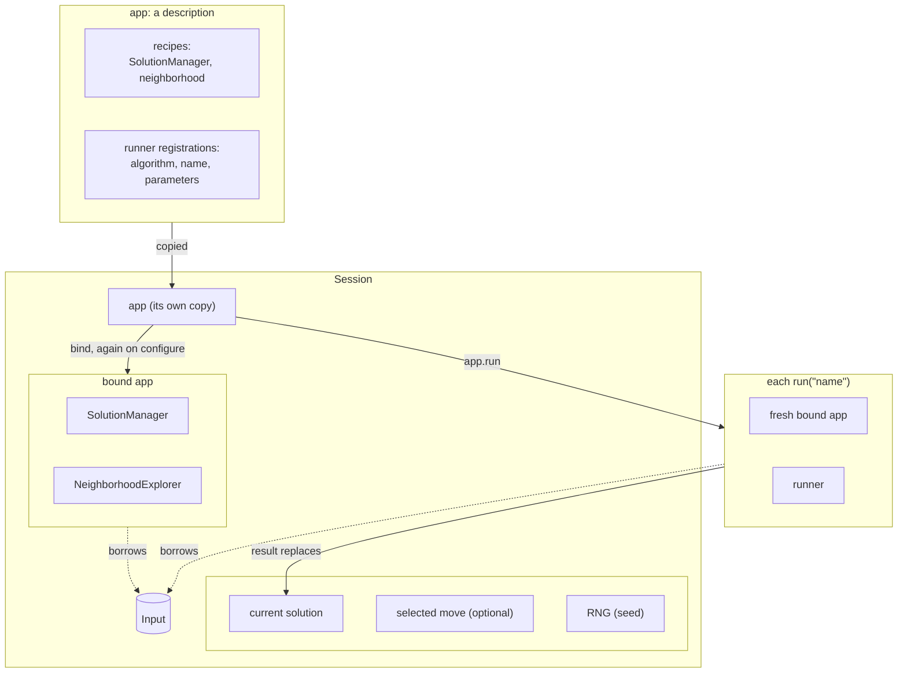

# 11. Applications

A runner (chapter 5) is one algorithm on one problem. An **app** packages the
whole problem: a name, the SolutionManager, the neighborhood, and the runners
available on it, each under a name of its own. A **Session** puts an app to
work on one Input. The interactive tester, the checks and the REST service of
the next chapters all start from an app.

## The app

<!-- snippet: tutorial/main.cpp:app -->
```cpp
auto application =
    el::app("tsp")
        .with_solution_manager(sm)
        .with_neighborhood(nhe)
        .with_runner<runners::FirstImprovement>("fi")
        .with_runner<runners::SimulatedAnnealing<Classic>>(
            "sa",
            {.temperature = {.samples_per_temperature = 50}});

auto piped_application = el::app("tsp") | sm | nhe
    | el::runner<runners::FirstImprovement>("fi")
    | el::runner<runners::SimulatedAnnealing<Classic>>(
        "sa",
        {.temperature = {.samples_per_temperature = 50}});
```

- An app is a description, like the recipes it holds: it builds nothing and
  runs nothing by itself.
- A runner is registered by its algorithm class and a name, optionally with its
  parameters (`parameters_type`). They are stored in the app and can be changed
  later with `runner_parameters<Algorithm>("name")`.
- Simulated Annealing is registered with its temperature policy's parameters:
  `runners::SimulatedAnnealing<Classic>` takes `ClassicParameters`.
- The two spellings are equivalent: `with_*` calls, or pipes with
  `el::runner<Algorithm>(name, parameters)` for each registration.

## The Session

A Session is the app at work on one Input. It owns the Input, builds the
services for it, and keeps a *current solution*, which you change by hand, one
move at a time, or by running a registered runner:

<!-- snippet: tutorial/main.cpp:session -->
```cpp
// The app on one Input, which the session owns, with a seeded RNG.
el::Session session{application, tsp, /* seed */ 2026};
session.use_initial_solution();

// A step by hand: select the first improving move, if any, and apply it.
if (session.use_first_improving_move())
    session.apply_move();

// A registered runner, by name, from the current solution; false means no
// runner has that name.
if (!session.run("sa")) // receives the session's RNG
    return 1;
const double session_cost = session.evaluate();
const Tour session_tour = session.solution(); // a copy: the session goes on
```

- `el::Session{application, tsp, seed}` copies the app and the Input: the
  session owns both, so it can outlive the variables it was built from. The
  seed starts the RNG that the session gives to stochastic runners, so the same
  seed repeats the same session. For another Input, build another Session.
- `use_initial_solution()` makes the initial tour the current solution
  (`use_random_solution(rng)` makes a random one).
- A step by hand takes two calls: `use_first_improving_move()` *selects* the
  first move that improves the current solution, and `apply_move()` applies
  it. The selection returns `false` when there is no such move, on a local
  optimum for example. `use_first_move`, `use_next_move`, `use_best_move` and
  `use_random_move` select in other ways; `evaluate_move()` gives the cost the
  selected move would lead to.
- `run("sa")` runs the runner registered as `"sa"` from the current solution,
  and makes its result the current solution. It returns `false` when no runner
  has that name.
- `evaluate()` and `solution()` read the current cost and solution.
  `solution()` returns a reference to the session's solution, which the next
  command may replace: copy it to keep it, as here.

The selections and `run` are `[[nodiscard]]`: the compiler warns when their
result is ignored, since a misspelt runner name would otherwise run nothing,
silently.

Each `run` builds fresh services from the app, with the runner's current
parameters, so runs share nothing but the immutable Input.

What the app and the Session hold, and what each run builds:



### Parameters and targets

The parameters of an app are those of its parts, by path:
`runners.<name>.*` for each runner's algorithm, `cost.*` for the weights of
its cost expression and `neighborhood.*` for the biases of a neighborhood
union. The session changes them, and stops a run at a target cost:

<!-- snippet: tutorial/main.cpp:session-parameters -->
```cpp
// The app's parameters by path; they change this session's app only.
const std::array changes{
    el::config::text_override{"runners.sa.temperature.cooling_rate", "0.9"}};
if (!session.configure(changes)) // all or none, checked
    return 1;

// A run that stops at the first tour of length 26 or less.
session.use_initial_solution();
if (!session.run("sa", el::stop_at(session.read_cost("26"))))
    return 1;
```

- `configure(changes)` applies `path = value` changes as chapter 9 does: all
  of them, checked, or none. They change the session's own copy of the app;
  when they touch the cost or the neighborhood, the session rebuilds its
  services, so `evaluate()` and the moves follow. `configuration()` lists the
  parameters with their current values.
- `read_cost("26")` reads a cost written as text: a number, `[hard, soft]` for
  a hierarchical cost, or the problem's own notation when it provides
  `read_cost(const Tsp&, std::string_view)`. `el::stop_at(cost)` makes the run
  stop at the first solution that reaches it, a known optimum or a lower
  bound for example.

## A command-line program

`el::cli::run` turns an app into a complete program: it reads the instance,
the seed, the runner and the app's parameters from the command line, runs the
runner on a Session and prints the result. The whole `main` of
`examples/tutorial/cli_main.cpp` is:

<!-- snippet: tutorial/cli_main.cpp:cli -->
```cpp
auto application = el::app("tsp")
    | (el::solution_manager<TourManager>() | el::component<TourLength>())
    | (el::neighborhood<TwoOptExplorer>()
        | el::delta<TourLength, TwoOptLengthDelta>())
    | el::runner<runners::FirstImprovement>("fi")
    | el::runner<runners::SimulatedAnnealing<Classic>>(
        "sa",
        {.temperature = {.samples_per_temperature = 50}});

return el::cli::run(application, argc, argv);
```

```text
$ easylocal_tutorial_cli --instance five.tsp --runner sa --seed 7
cost 26
time 0.0119483
iterations 6750
evaluations 6751
termination completed
2 3 1 0 4
```

| Switch | |
| --- | --- |
| `--instance <file>` | the Input, read with the `read_input` hook (chapter 5); required |
| `--seed <n>` | the seed of the random generator given to random solutions and stochastic runners |
| `--runner <name>` | a registered runner; the first one when empty |
| `--start random`, `--start initial` | the starting solution; random by default when the problem has `random_solution` |
| `--solution <file>` | the starting solution read from a file, with `read_solution` |
| `--output <file>` | where the solution goes, with `write_solution`; standard output by default |
| `--target <cost>` | stop at the first solution that reaches this cost, as `session.read_cost` reads it |
| `--timeout <seconds>` | stop the run after this many seconds, such as `10` or `2.5`; the termination is then `time limit reached` |
| `--max_evaluations <n>` | stop the run after `n` evaluations (`unlimited` by default); a runner's own budget, if smaller, still applies |
| `--runners.<name>.*`, `--cost.*`, `--neighborhood.*` | the app's parameters, as `configuration()` lists them |
| `--report true` | also print the value of each cost component, see below |
| `--trace <file>` | record the [trace](../tracing.md) of the run, with timestamps: JSON Lines for a `.jsonl` name, ELTR otherwise |
| `--config <file>` | the same settings from a file (chapter 9); `--help` lists them all |

- It prints `cost`, `time` (the seconds of the run), the effort of the run
  when the algorithm reports it (the built-in ones do: `iterations`,
  `evaluations` and `termination`, why it stopped) and the solution. The exit
  status is 0 after a run, 2 for an invalid command line (an unknown runner,
  a missing instance) and 1 when the run fails, for example on an unreadable
  file.
- Parameters of the program's own take part as a parameter set, parsed with
  the others: `el::cli::run(application, argc, argv, {.parameters = own})`,
  where `own` holds blocks that outlive the call (chapter 9).
- The values of the switches when the command line does not give them come
  from `defaults`, a `cli::parameters`: the examples of `examples/` start
  from their own instance with
  `{.defaults = {.instance = "...", .seed = 2026, .start = "initial"}}`.
- A program that needs more, such as several runs or a solver, builds the same
  steps from `el::config::load_and_apply` and a Session; see the
  [reference](../reference/app-and-tools.md).

The TextUI (chapter 12) and the REST service (chapter 14) take the same
parameter paths and targets.

### A report of the cost components

With `--report true`, `cli::run` also prints the value of each cost component
of the final solution. A component can take part in the report with two
optional members, a name and a text that explains its value; `TourLength`
lists the edges it adds up:

<!-- snippet: tutorial/tsp.hpp:component-text -->
```cpp
// Optional, for people: the name of the component and a text that
// explains its value on a tour, here the edges it adds up (chapter 11).
static std::string_view name()
{
    return "TourLength";
}

std::string describe(const Tour& tour) const
{
    const auto n = tour.order.size();
    std::string text;
    for (std::size_t k = 0; k < n; ++k)
    {
        const auto edge = input_.distance[tour.order[k]][tour.order[(k + 1) % n]];
        text += (k == 0 ? "" : " + ") + std::format("{}", edge);
    }
    return text;
}
```

```text
$ easylocal_tutorial_cli --instance five.tsp --runner fi --seed 1 --report true
cost 26
time 1.5e-05
iterations 2
evaluations 9
termination local optimum
component TourLength 26
  2 + 4 + 6 + 5 + 9
0 1 3 4 2
```

- Both members are optional. Without `name()`, a component is shown by its
  position in the recipe, `#1`; without `describe`, only its value is shown.
- The value is the component's own, before the weights of the cost
  expression.
- `describe` is the place for what EasyLocal 3's `PrintViolations` printed:
  the violations a constraint counts, for example.
- The same report is `session.cost_report()` in a program, and the
  solution window of the TextUI (chapter 12) shows it.

### Tuning the parameters with irace

The best values of a runner's parameters depend on the problem and on its
instances. [irace](https://mlopez-ibanez.github.io/irace/) finds them
automatically: it runs the program on a set of instances with candidate
values, compares the costs it prints and races the candidates until the best
ones are left. A program made with `cli::run` writes everything irace needs
from its own parameters, so the files never drift from the switches the
program accepts.

irace is an R package: install [R](https://www.r-project.org/), then
`Rscript -e 'install.packages("irace")'`.

**What is tuned.** A parameter is tuned when it has a finite domain: the values
it may take, declared in the schema of its block (chapter 9). The built-in runners
declare the domains of their rates and probabilities, such as Simulated
Annealing's `cooling_rate` in (0, 1). A temperature's domain is every positive
number, since its good values depend on the scale of the costs: a program
gives it a finite range for tuning, as it may narrow any domain. The conditions and requirements of the schema
(chapter 9) come along: a parameter is tuned only when it matters, and irace
never proposes values that break a requirement. `examples/tsp/sa_main.cpp`
gives a range to the initial temperature:

<!-- snippet: tsp/sa_main.cpp:tuning -->
```cpp
// --tuning.irace=DIR writes an irace scenario: the parameters with a domain
// are tuned, here also the initial temperature, on a logarithmic scale.
return easylocal::cli::run(
    application,
    argc,
    argv,
    {.defaults =
            {
                .instance = EASYLOCAL_TSP_INSTANCE_FILE,
                .seed = 2026,
                .start = "initial",
            },
        .tuning = {
            {"runners.sa.temperature.initial_temperature",
                easylocal::config::range(1.0, 100.0).log()},
        }});
```

**The scenario.** `--tuning.irace=DIR` creates the directory and writes the
scenario, without running anything; the other switches on the same command
line are the values every run starts from:

```text
$ easylocal_tsp_sa --tuning.irace=tuning --runners.sa.temperature.allowed_iterations=20000
wrote tuning/parameters.txt
wrote tuning/fixed.conf
wrote tuning/target-runner
wrote tuning/instances.txt
wrote tuning/scenario.txt
updated tuning/configurations.txt
2 parameters to tune, 3 more to complete in parameters.txt; then run irace in tuning
```

| File | |
| --- | --- |
| `parameters.txt` | the parameters to tune, one per line with its switch, type, range and condition; the others are commented out, with a range to start from; the requirements as `[forbidden]` combinations |
| `configurations.txt` | the current values, which irace tries first |
| `fixed.conf` | the values given on the command line, read by every run with `--config` |
| `target-runner` | the script irace calls: it runs the program with `--tuning.print=cost` on an instance, a seed and the candidate values |
| `instances.txt` | the instances to tune on, one per line: the program's default instance to begin with |
| `scenario.txt` | irace's settings: the files above and the budget, `maxExperiments`, the number of runs |

```text title="parameters.txt"
# Multiplicative cooling factor (default 0.75)
runners.sa.temperature.cooling_rate "--runners.sa.temperature.cooling_rate=" r (0.0001, 0.9999)

# Maximum number of annealing iterations (default 20000)
# no finite domain: a range around the default to start from
# runners.sa.temperature.allowed_iterations "--runners.sa.temperature.allowed_iterations=" i,log (2000, 200000)
```

Here the initial acceptance is not tuned: it matters only when
`calibration_samples` is above 0, and that parameter is not tuned and is 0.
Its line is commented out, with the condition irace needs when both are
uncommented. The requirement between the temperatures becomes a forbidden
combination, with the final temperature at its value:

```text title="parameters.txt"
[forbidden]
# final_temperature must be smaller than initial_temperature
# with every parameter it names tuned: !(runners.sa.temperature.final_temperature < runners.sa.temperature.initial_temperature)
!(0.25 < runners.sa.temperature.initial_temperature)
```

The files are a stub to edit: the program never overwrites them. List the
instances in `instances.txt`, set the budget in `scenario.txt`, uncomment a
parameter or change a range in `parameters.txt`, and add to the `[forbidden]`
section the combinations that are not valid and that the program does not
declare. Then run `--tuning.irace=DIR` again: it checks that
every parameter of `parameters.txt` is one of the program's and rewrites
`configurations.txt` to agree with it, moving a current value into its range
when it is outside. Finally, run irace in the directory:

```text
$ cd tuning && irace
...
# Best configurations as commandlines (first number is the configuration ID; listed from best to worst according to the sum of ranks):
11 --runners.sa.temperature.initial_temperature=4.1621 --runners.sa.temperature.cooling_rate=0.6166
30 --runners.sa.temperature.initial_temperature=5.4712 --runners.sa.temperature.cooling_rate=0.6343
```

The best configurations are switches of the program: give them on its command
line, or as `path = value` lines in a configuration file (chapter 9).

**The cost as one number.** irace compares runs by one number, which
`--tuning.print=cost` prints (`cost_time` adds the running time in seconds).
A number is itself; a hierarchical cost is `hard * W + soft`, and a
lexicographic one weighs each value by a power of `W`, with `W` from
`--tuning.hard_weight` (10^9 by default), which must exceed every soft cost. A
problem can give its own number with a `scalar_cost(const Input&, const
Cost&)` function next to its Input, found as `read_cost` is. The parameters of
the cost, such as the weights of a `cost::sum`, are never tuned: they define
the cost that irace compares.

## See also

- [Apps and tools](../reference/app-and-tools.md): the complete app and Session
  interfaces.

## Next steps

[Chapter 12](12-tester.md) explores the app in the interactive tester.
