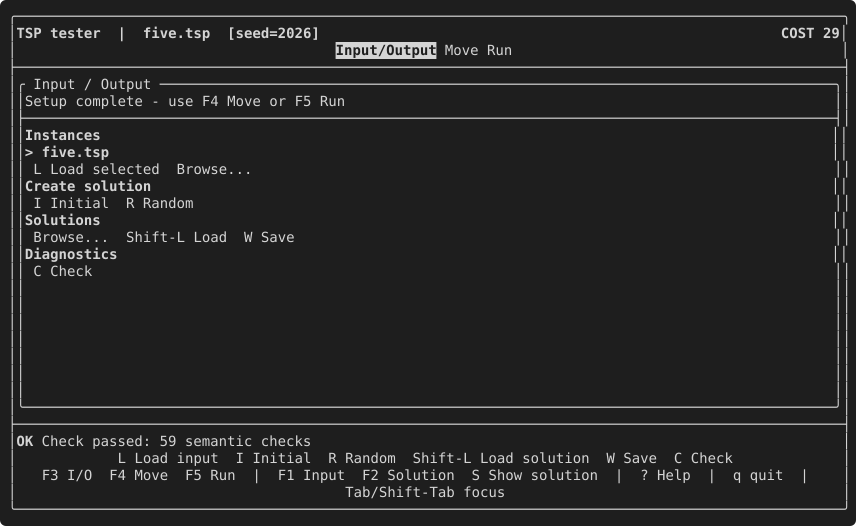
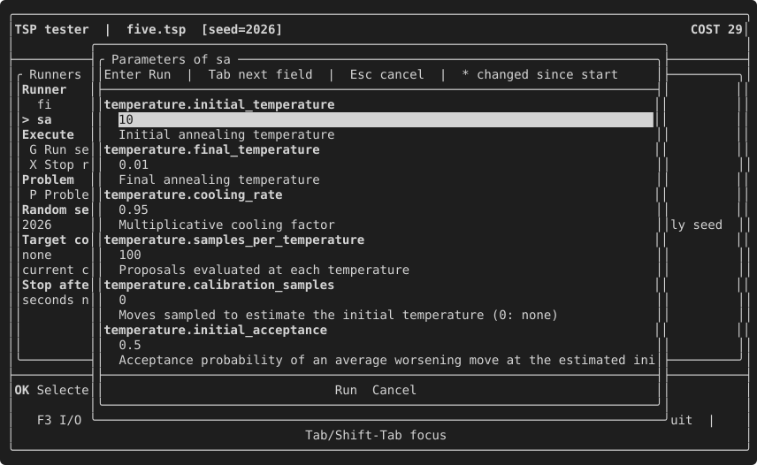

# 12. The interactive tester

The **interactive tester** (the TextUI) is a Session with a terminal interface:
load an Input and a Solution, browse, evaluate and apply moves, run the
registered runners in the background with live progress and cancellation, and
run the checks of chapter 13. It is the optional `TUI` component (FTXUI):

```cmake
find_package(EasyLocal CONFIG REQUIRED COMPONENTS Core TUI)
target_link_libraries(tsp_tui PRIVATE EasyLocal::TUI)
```

<!-- snippet: tutorial/tui_main.cpp:tui -->
```cpp
auto application = el::app("tsp")
    | (el::solution_manager<TourManager>() | el::component<TourLength>())
    | (el::neighborhood<TwoOptExplorer>()
        | el::delta<TourLength, TwoOptLengthDelta>())
    | el::runner<runners::FirstImprovement>("fi")
    | el::runner<runners::SimulatedAnnealing<Classic>>("sa");

el::tui::run(
    application,
    {
        .title = "TSP tester",
        .seed = 2026, // the RNG for random solutions, moves and stochastic runners
        .input_path = EASYLOCAL_TUTORIAL_INSTANCE, // loaded with the read_input hook
    });
```

`tui::run(application, options)` opens the tester on the app and returns when
the user quits. It loads the Input from `input_path` first, through the
`read_input` hook described below; without one, the user loads it from the
Input/Output page.

The program is `examples/tutorial/tui_main.cpp`, built when the TUI component
is enabled (`-DEASYLOCAL_ENABLE_TUI=ON`).

## A tour of the pages

The tester has three pages, switched with F3, F4 and F5; the header shows the
instance, the current seed and the cost of the current solution.

On the **Input/Output** page, `I` creates the initial solution and `C` runs the
app check of chapter 13:



On the **Move** page, `B` selects the best move; the panel shows its incremental
and full evaluation, and `A` would apply it:


On the **Run** page, `G` (or Enter on the runner list) first opens a window
with the parameters of the selected runner, the same ones a configuration file
sets (chapter 9): each with its description and its current value, which you
can edit. Enter runs it; Esc cancels:



The values are checked before anything runs: an invalid one, such as a cooling
rate of 2, keeps the window open with the error next to it, and nothing is
changed. Accepted values stay for the rest of the session, so the next runs
use them too, and the Run page lists every parameter that differs from its
value at start. A runner without parameters runs directly.

The runner runs in the background with live progress and can be stopped with
`X`; here Simulated Annealing improves the tour from 29 to 26:


The *Target cost* field stops a run as soon as its solution reaches a cost,
for example a known optimum or a lower bound: 26 here would end Simulated
Annealing at the first tour of that length. It is written as a number, or as
`[hard, soft]` for a hierarchical cost, as the line below the field shows the
current cost; empty, runs have no target.

When the problem itself has parameters, the weights of a `cost::sum`
(chapter 2) or the biases of a neighborhood union (chapter 6), `P` on the Run
page opens a window for them. They are shared by every runner and also by the
Move page, so applying them updates at once the cost in the header and the
evaluation of the moves.

The screenshots are generated from the real program by
`uv run scripts/tui-snapshots.py`, which drives it in a pseudo-terminal. The
same driver (`scripts/tui_driver.py`) runs the end-to-end tests in `tests/tui`:
keys are sent, and each step waits for what the screen should show.

## Loading, saving and displaying

The TextUI loads and saves files, and displays values, through the hooks of
[chapter 5](05-running-a-search.md#reading-the-instance-printing-the-solution):
`read_input` for the Input, `read_solution` and `write_solution` for the
Solution, `describe` for the Input, the Solution and the Move. The solution
window (`S` or F2) also lists each cost component's value, with its
`describe(solution)` text when it has one (chapter 11). Commands whose
hook is missing are not offered. A Solution without a `describe` hook is shown
as `write_solution` writes it; a value with neither is shown as *not
printable*.

The page title of the Move page, *Move - 2-opt*, comes from a static `name()`
member of `TwoOptExplorer`:

<!-- snippet: tutorial/tsp.hpp:two-opt-name -->
```cpp
// The name of the neighborhood in the interactive tester (chapter 12).
static std::string_view name()
{
    return "2-opt";
}
```

## Several apps on the same problem

An app has one neighborhood. To explore several, one per app, open them from
a **launcher**: a list of apps that share the Input and the current solution.
The TSP example (`examples/tsp`) has one app for the 2-opt moves and one for
the swaps, over the same SolutionManager recipe:

<!-- snippet: tsp/apps.hpp:apps -->
```cpp
// The SolutionManager recipe of both apps: the launcher of tui_main.cpp
// passes the Input and the solution from one app to the other, so they must
// have the same one.
inline auto tsp_solution_manager()
{
    return easylocal::solution_manager<TspSolutionManager>()
        | easylocal::cost::apply(
            TourLengthCost{},
            easylocal::component<TourLengthComponent>());
}

// Two apps over the same SolutionManager, one per neighborhood. The type of an
// app spells out all its recipes, so the functions let auto deduce it.
inline auto two_opt_app()
{
    auto application = easylocal::app("tsp-two-opt") | tsp_solution_manager()
        | (easylocal::neighborhood<TwoOptNeighborhoodExplorer>()
            | easylocal::delta<TourLengthComponent, TwoOptTourLengthDeltaEvaluator>())
        | easylocal::runner<easylocal::runners::FirstImprovement>("fi");
    application.runner_config<easylocal::runners::FirstImprovement>().max_evaluations =
        100;
    return application;
}

inline auto swap_app()
{
    auto application = easylocal::app("tsp-swap") | tsp_solution_manager()
        | (easylocal::neighborhood<SwapCitiesNeighborhoodExplorer>()
            | easylocal::delta<TourLengthComponent, SwapTourLengthDeltaEvaluator>())
        | easylocal::runner<easylocal::runners::FirstImprovement>("fi");
    application.runner_config<easylocal::runners::FirstImprovement>().max_evaluations =
        100;
    return application;
}
```

<!-- snippet: tsp/tui_main.cpp:launcher -->
```cpp
easylocal::tui::run_launcher(
    {
        .title = "EasyLocal TSP Tester",
        .tester =
            {
                .seed = 0,
                .input_path = EASYLOCAL_TSP_MWE_INSTANCE_FILE,
                .solution_path = EASYLOCAL_TSP_MWE_SOLUTION_FILE,
            },
    },
    tsp::two_opt_app(),
    tsp::swap_app());
```

- The launcher owns the Input, read from `tester.input_path` when it is set,
  and the current solution. Its first entry, *Input and solution*, opens the
  Input/Output page alone: load another instance, load or save a solution,
  create the initial or a random one.
- Each app opens in the tester on the shared Input and solution. It creates
  solutions, selects and applies moves and runs its runners, but loads no
  files: its Input/Output page has no loading commands. When you leave it
  (`q`), what it left becomes the shared state: a solution created or
  improved with the swaps is the current solution of the 2-opt app.
- Since solutions pass from one app to the other, the apps must have the same
  SolutionManager recipe, cost included: they differ in the neighborhood and
  the runners. A launcher of apps with different recipes does not compile.
- To search with both neighborhoods at once, compose them in one app with
  `neighborhood_union` (chapter 6); the launcher is for examining them one at
  a time.

## Options

`tui::options` sets the `title`, the `seed` of the RNG used for random
solutions, random moves and stochastic runners, and the initial `input_path`
and `solution_path`. The seed can also be changed on the Run page ("Random
seed", then Enter or *Apply seed*): the RNG restarts from it, and the header
shows the current seed.

## See also

- [Apps and tools](../reference/app-and-tools.md).

## Next steps

[Chapter 13](13-checking.md) checks the composed problem, from code and from
the tester.
