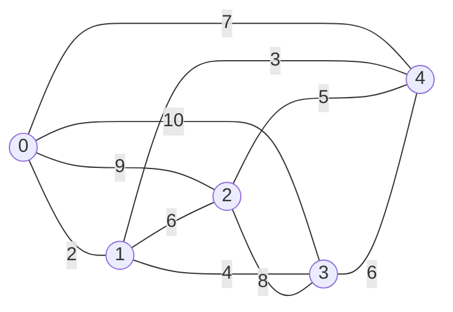

# Tutorial

Build a local search solver for the symmetric Travelling Salesperson Problem
(TSP), then give it configuration, tests and user interfaces. Each chapter
adds one capability to the same program, reusing the components you have
already written. Links to the [reference](../reference/README.md) provide the
full API details when you need them.

If you have not done so yet, start with the [quick start](../quick-start.md):
it is the complete program of the first chapters, in one file.

*:material-file-pdf-box: This section is also [a PDF](https://iolab-uniud.github.io/easylocal/pdf/easylocal-tutorial.pdf), built with the site.*{ .pdf-of-this-section }

## The running example

The TSP asks for the shortest round trip that visits every city exactly once.
In the symmetric version, distances are the same in both directions. We use
five cities with these distances:



In the code the instance is a distance matrix, one row per city:

<!-- snippet: tutorial/tsp.hpp:instance -->
```cpp
inline Tsp five_cities()
{
    return Tsp{
        .distance =
            {
                {0, 2, 9, 10, 7},
                {2, 0, 6, 4, 3},
                {9, 6, 0, 8, 5},
                {10, 4, 8, 0, 6},
                {7, 3, 5, 6, 0},
            },
    };
}
```

The shortest round trip has length 26, reached by two tours (each
also in the opposite direction): 0 → 1 → 3 → 2 → 4 → 0 (2 + 4 + 8 + 5 + 7) and
0 → 1 → 3 → 4 → 2 → 0 (2 + 4 + 6 + 5 + 9).

The chapters build the solver in this order:

- chapters 1 and 2 model a tour as a sequence of cities and give it a cost;
- chapter 3 defines swaps and 2-opt moves, which reverse a segment of the
  tour, and shows how to enumerate them with a generator or a cursor;
- chapter 4 computes the effect of a 2-opt move on the length from four
  distances only;
- chapter 5 runs both First Improvement and Simulated Annealing, and chapter 6
  lets a search use both moves;
- the remaining chapters build on these pieces: new algorithms, solvers,
  configuration, testing and the interactive and HTTP tools.

The complete code lives in `examples/tutorial/`: `tsp.hpp` defines the problem,
`main.cpp` runs the searches and `checks.cpp` tests the components. The examples
are built and tested with the library, and the snippets on these pages are
checked against their sources. You can follow along in the files or use them
as a starting point for your own problem.

## The workflow

Every EasyLocal program follows the same three steps:

```text
model     values      Input (immutable), Solution, Move
          services    SolutionManager        valid solutions, construction
                      cost components        one term of the objective each
                      cost expression        the cost from the component values
                      NeighborhoodExplorer   moves: enumeration, sampling, application
                      delta cost components  the change of a component under a move

compose   a runner    an algorithm plus the recipes of the services
                      (and, optionally, a solver or an app around it)

run       bind the runner to an Input, run it from a solution, read the result
```

The SolutionManager, cost components and cost expression form the *cost
layer*. The NeighborhoodExplorer and its deltas form the *delta cost layer*.
Recipes describe how to assemble these services; binding a runner to an Input
constructs them. The services borrow the Input by `const&` and leave it unchanged.

Start with the members your search needs. Later chapters add features for
solvers, checks and interactive tools as they become useful. Missing
capabilities are checked at compile time, so you can develop the problem
incrementally without implementing an entire interface up front.

## Conventions of the code

The library uses namespace `easylocal`. The examples declare two aliases at
the start of each program to keep the snippets short:

<!-- snippet: tutorial/main.cpp:aliases -->
```cpp
using namespace tutorial;               // the tutorial's types: Tsp, Tour, ...
namespace el = easylocal;               // el::app, el::component, ...
namespace runners = easylocal::runners; // runners::FirstImprovement, ...
```

Thus `el::app` means `easylocal::app`. Put aliases in a function or source
file to avoid introducing them into files that include your headers. Unlike
`using namespace easylocal;`, an alias keeps the library's names identifiable.

The first line brings in the tutorial's own types, from `tsp.hpp`, so the
snippets write `Tour` for `tutorial::Tour`.

## Chapters

1. [Modelling the problem](01-problem-model.md): Input, Solution, Move and the
   SolutionManager.
2. [The cost](02-cost.md): cost components, cost expressions, structured costs.
3. [Moves](03-neighborhood.md): the NeighborhoodExplorer.
4. [Delta evaluation](04-delta-evaluation.md): evaluating moves incrementally.
5. [Running a search](05-running-a-search.md): runners, built-in algorithms,
   results, reading the instance and printing the solution.
6. [Combining neighborhoods](06-combining-neighborhoods.md): `neighborhood_union`.
7. [Writing your own runner](07-custom-runner.md): `search_run`.
8. [Solvers](08-solvers.md): from an Input to a final solution.
9. [Configuration](09-configuration.md): parameters from the command line and
   files.
10. [Testing your components](10-testing.md): contract checks.
11. [Applications](11-apps-and-tools.md): the app, a problem and its runners,
    the Session that runs it on an Input, and a command-line program.
12. [Tuning with irace](12-tuning.md): the parameters of a program, tuned
    on its instances.
13. [The interactive tester](13-tester.md): the TextUI.
14. [Checking a composed problem](14-checking.md): `check`, and the
    neighborhood checks of a Session.
15. [A REST service](15-rest.md): searches over HTTP.
16. [Observing and controlling a run](16-observing-and-controlling.md):
    progress, cancellation, tracing.
17. [Building without CMake](17-building.md): a makefile, and the headers and
    libraries of every component.

Porting an EasyLocal 3 program? [Coming from EasyLocal 3](../from-easylocal-3.md)
walks through the migration step by step.
