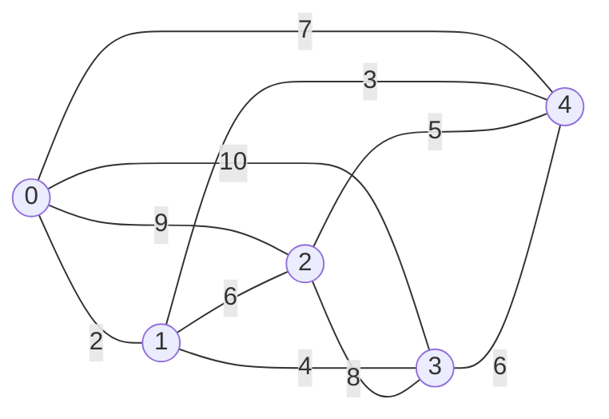

# Tutorial

This tutorial builds a local search solver for the symmetric Travelling
Salesperson Problem (TSP), one capability per chapter. Each chapter builds on
the previous one and ends with links to the [reference](../reference/README.md)
pages that describe the components in full.

If you have not done so yet, start with the [quick start](../quick-start.md):
it is the complete program of the first chapters, in one file.

## The running example

A salesperson must visit a set of cities, each exactly once, and come back to
the city they started from; the distance between two cities is the same in
both directions. The symmetric TSP asks for the shortest such round trip. The
example instance has five cities, with these distances:



In the code the instance is a distance matrix, one row per city:

<!-- snippet: tutorial/tsp.hpp:instance -->
```cpp
inline Tsp five_cities()
{
    return Tsp{
        .distance =
            {
                {0, 2, 9, 10, 7},
                {2, 0, 6, 4, 3},
                {9, 6, 0, 8, 5},
                {10, 4, 8, 0, 6},
                {7, 3, 5, 6, 0},
            },
    };
}
```

The shortest round trip has length 26, reached by two tours (each
also in the opposite direction): 0 → 1 → 3 → 2 → 4 → 0 (2 + 4 + 8 + 5 + 7) and
0 → 1 → 3 → 4 → 2 → 0 (2 + 4 + 6 + 5 + 9).

The chapters build the solver in this order:

- chapters 1 and 2 model a tour as a sequence of cities and give it a cost;
- chapter 3 defines two kinds of moves, swapping two cities, as in the quick
  start, and 2-opt, which reverses a part of the tour; they show the two ways
  of listing moves, a generator and a cursor;
- chapter 4 computes the effect of a 2-opt move on the length from four
  distances only;
- chapter 5 runs both First Improvement and Simulated Annealing, and chapter 6
  lets a search use both moves;
- the remaining chapters build on these pieces: new algorithms, solvers,
  configuration, testing and the interactive and HTTP tools.

All the code of the tutorial lives in `examples/tutorial/`: `tsp.hpp` holds the
problem components, `main.cpp` the searches and `checks.cpp` the component
tests. They are built and run with the test suite, and every snippet marked
`<!-- snippet: ... -->` in these pages is checked against them
(`scripts/sync-doc-snippets.py`), so the code you read here is the code that
runs.

## The workflow

Every EasyLocal program follows the same three steps:

```text
model     values      Input (immutable), Solution, Move
          services    SolutionManager        valid solutions, construction
                      cost components        one term of the objective each
                      cost expression        the cost from the component values
                      NeighborhoodExplorer   moves: enumeration, sampling, application
                      delta cost components  the change of a component under a move

compose   a runner    an algorithm plus the recipes of the services
                      (and, optionally, a solver or an app around it)

run       bind the runner to an Input, run it from a solution, read the result
```

The SolutionManager with its cost components and cost expression forms the
*cost layer*; the NeighborhoodExplorer with its delta cost components forms the *delta
cost layer*. You describe these compositions with recipes, and the framework
materializes them when the runner is bound to an Input.

Components are specified incrementally: you write only what the algorithms and
tools you use need, and the compiler tells you when a capability is missing.
The early chapters write the essential version of each component; the
*advanced components*, such as solvers, the Session checks and the
interactive tester, need a few more features, added in the chapters that introduce them.
Services borrow the Input by `const&` and never mutate it.

## Conventions of the code

The library lives in the namespace `easylocal`. The snippets of the tutorial
write it `el::`, and its runners `runners::`, through two namespace aliases
declared at the start of each program, before the code the snippets show:

<!-- snippet: tutorial/main.cpp:aliases -->
```cpp
using namespace tutorial;               // the tutorial's types: Tsp, Tour, ...
namespace el = easylocal;               // el::app, el::component, ...
namespace runners = easylocal::runners; // runners::FirstImprovement, ...
```

A namespace alias is a shorter name for the same namespace, local to the
scope that declares it: `el::app` is `easylocal::app`. Declare the aliases
in each function, or once in a source file, but not in a header, where they
would reach every file that includes it. The tutorial prefers aliases to
`using namespace easylocal;`, which would bring all the library's names into
scope and hide which ones are the library's.

The first line brings in the tutorial's own types, from `tsp.hpp`, so the
snippets write `Tour` for `tutorial::Tour`.

## Chapters

1. [Modelling the problem](01-problem-model.md): Input, Solution, Move and the
   SolutionManager.
2. [The cost](02-cost.md): cost components, cost expressions, structured costs.
3. [Moves](03-neighborhood.md): the NeighborhoodExplorer.
4. [Delta evaluation](04-delta-evaluation.md): evaluating moves incrementally.
5. [Running a search](05-running-a-search.md): runners, built-in algorithms,
   results, reading the instance and printing the solution.
6. [Combining neighborhoods](06-combining-neighborhoods.md): `neighborhood_union`.
7. [Writing your own runner](07-custom-runner.md): `search_run`.
8. [Solvers](08-solvers.md): from an Input to a final solution.
9. [Configuration](09-configuration.md): parameters from the command line and
   files.
10. [Testing your components](10-testing.md): contract checks.
11. [Applications](11-apps-and-tools.md): the app, a problem and its runners,
    and the Session that runs it on an Input.
12. [The interactive tester](12-tester.md): the TextUI.
13. [Checking a composed problem](13-checking.md): `check`, and the
    neighborhood checks of a Session.
14. [A REST service](14-rest.md): searches over HTTP.
15. [Observing and controlling a run](15-observing-and-controlling.md):
    progress, cancellation, tracing.
16. [Comparison with EasyLocal 3](16-comparison-with-easylocal-3.md).

Porting an EasyLocal 3 program? [Coming from EasyLocal 3](../from-easylocal-3.md)
takes one through, step by step.
